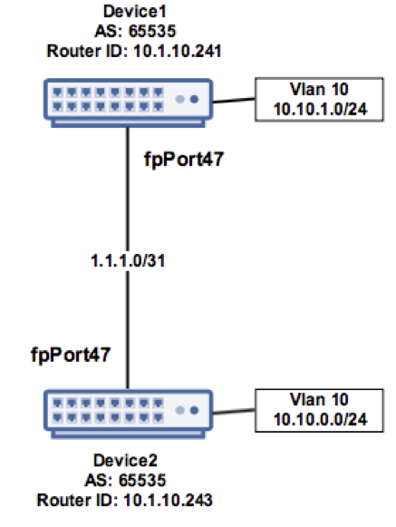

.. FlexSwitchSDK documentation master file, created by
   sphinx-quickstart on Mon Apr  4 12:27:04 2016.
   You can adapt this file completely to your liking, but it should at least
   contain the root `toctree` directive.

.. sectnum::

Configuration Examples 
========================================

Configuring ARP
---------------

The ARP protocol is utilized to be learn the layer 2 MAC address of a directly attached device and associate it with an IP address in which to communicate.  ARPd is the daemon on FlexSwitch that manages, learns, and programs layer 2 adjancency information into the data-plane.   

Timeout Values
^^^^^^^^^^^^^^
FlexSwitch supports the ability to change the ARP timers Globally.  The default timeout value is 10 minutes(600 seconds).  ARP daemon will attempt refresh of the ARP entry at the following intervals, with example times based on default timer and number of attempts:

	- 50% of ARP timeout (300 seconds, 1 ARP request frame sent)
	- 25% of ARP timeout (150 seconds, 1 ARP request frame sent)

With more aggressve attempts in the last minute for timeout:

	- 60 seconds of ARP Timeout (1 ARP request frame sent)
	- 30 seconds remaining in ARP Timeout (1 ARP request frame sent)
	- 10 seconds remaining in ARP timeout (10 ARP request frames sent)

Configuring  with Rest API 
"""""""""""""""""""""""""""""""""""""

FlexSwitch has a REST based API, and below is an example utilzing Linux cURL: 

**COMMAND:**
::
	
	curl -X POST --header 'Content-Type: application/json' --header 'Accept: application/json' -d '{"ArpConfigKey":"VRF Name", "Timeout":<*Timeout Value in seconds*>}' 'http://<*your-switchip*>:8080/public/v1/config/ArpConfig'
	

**OPTIONS:**

+------------+------------+-------------------------------------------+----------+----------+
| Variables  | Type       |  Description                              | Required |  Default |   
+============+============+===========================================+==========+==========+ 
|ArpConfigKey| string     | VRF name where configuration is applied.  |    No    | "default"|
+------------+------------+-------------------------------------------+----------+----------+
| Timeout    | integer    | Length of ARP timeout in seconds.         |    Yes   |    600s  |   
+------------+------------+-------------------------------------------+----------+----------+ 

**EXAMPLE:**
::
	
	root@5b5a8d783113:/# curl -X POST --header 'Content-Type: application/json' --header 'Accept: application/json' -d '{"ArpConfigKey":"1", "Timeout":1000}' http://localhost:8080/public/v1/config/ArpConfig
	{"ObjectId":"a97b920d-8b10-47b1-7ea9-890b07f6e712","Error":""}

	root@5b5a8d783113:/# curl -X GET --header 'Content-Type: application/json' --header 'Accept: application/json' http://localhost:8080/public/v1/config/ArpConfigs | python -m json.tool
	  % Total    % Received % Xferd  Average Speed   Time    Time     Time  Current
					 Dload  Upload   Total   Spent    Left  Speed
	100   174  100   174    0     0  87087      0 --:--:-- --:--:-- --:--:--  169k
	{
	    "CurrentMarker": 0,
	    "MoreExist": false,
	    "NextMarker": 0,
	    "ObjCount": 1,
	    "Objects": [
		{
		    "Object": {
			"ArpConfigKey": "1",
			"Timeout": 1000
		    },
		    "ObjectId": "a97b920d-8b10-47b1-7ea9-890b07f6e712"
		}
	    ]
	}

Configuring with Python SDK
""""""""""""""""""""""""""""""""""

Setting the ARP Timeout to 1000 seconds via FlexSwitch's Python SDK, utilizing method *createArpConfig()*. 

**COMMAND:**
::

	>>> FlexSwitch("*Switch IP*", *TCP port*).createArpConfig("<*VRF*>",<"*Timeout*">)
	
**OPTIONS:**

::
	
+------------------+------------+------------+-------------------------------------------+----------+----------+
| Python Method    | Variables  | Type       |  Description                              | Required |  Default |   
+==================+============+============+===========================================+==========+==========+ 
| createArpConfig  |ArpConfigKey| string     | VRF name where configuration is applied.  |    No    | "default"|
+                  +------------+------------+-------------------------------------------+----------+----------+
|                  | Timeout    | integer    | Length of ARP timeout in seconds.         |    Yes   |    600s  |   
+------------------+------------+------------+-------------------------------------------+----------+----------+   

**EXAMPLE:**

Below are examples for utilizing this method via the Python CLI, python script and Displaying the results 

1. Python CLI:

::  

	>>> from flexswitchV2 import FlexSwitch
	>>> FlexSwitch("10.1.10.243", 8080).createArpConfig("1", 1000)
	({u'ObjectId': u'45dff5a0-7dc1-441d-723d-ccf731186ece', u'Error': u''}, None)      

	>>> FlexSwitch("10.1.10.243", 8080).getAllArpConfigs()
	[{u'Object': {u'ConfigObj': None, u'ArpConfigKey': u'1', u'Timeout': 1000}, u'ObjectId': u'45dff5a0-7dc1-441d-723d-ccf731186ece'},	

.. Note:: the ObjectID and UUID are the same.

2. Utilizing a Python Script to set ARP timeout

::

	#!/usr/bin/python
	from flexswitchV2 import FlexSwitch

	if __name__ =='__main__':
		switch_ip = "10.1.10.243"
		Timeout=1000
		restIf = FlexSwitch(switch_ip, 8080)
		restIf.createArpConfig("1",Timeout)

3. Display results of this change:

::

	#!/usr/bin/python
	import json
	from flexswitchV2 import FlexSwitch

	if __name__ =='__main__':
		switch_ip = "10.1.10.243"
		restIf = FlexSwitch(switch_ip, 8080)
		print json.dumps(restIf.getAllArpConfigs(), indent=4)	

Output:

::

	acasella@snaproute-lab-r710-1:~$ python getarpconfig.py 
	[
	    {
		"Object": {
		    "ArpConfigKey": "1", 
		    "Timeout": 1000
		}, 
		"ObjectId": "e607400d-71f1-4fd2-4574-e40d313fd3e7"
	    }
	]

Configuring via Configuration file 
""""""""""""""""""""""""""""""""""

-----------------

Configuring Static Entries
^^^^^^^^^^^^^^^^^^^^^^^^^^

Configuring with Rest API 
""""""""""""""""""""""""""""""""

FlexSwitch has a REST based API, and below is an example utilzing Linux cURL:

**COMMAND:**
::

        curl -X POST --header 'Content-Type: application/json' --header 'Accept: application/json' -d '{"IP":"<*IPv4 Address*>", "MAC":"<*MAC address*>"}' 'http://<*your-switchip*>:8080/public/v1/config/ArpConfig'

**OPTIONS:**

+------------+------------+---------------------------------------------------+----------+----------+
| Variables  | Type       |  Description                                      | Required |  Default |    
+============+============+===================================================+==========+==========+  
| IP         | String     | IPv4 address to have a static entry applied       |    Yes   |   None   |
+------------+------------+---------------------------------------------------+----------+----------+
| MAC        | String     | Layer 2 MAC address associated with IPv4 address. |    Yes   |   None   |   
+------------+------------+---------------------------------------------------+----------+----------+  

	
**EXAMPLE:**
::

        root@5b5a8d783113:/# curl -X POST --header 'Content-Type: application/json' --header 'Accept: application/json' -d '{"IP":"192.168.0.1", "MAC":"01:23:34:56:78"}' http://localhost:8080/public/v1/config/ArpConfig
        {"ObjectId":"a97b920d-8b10-47b1-7ea9-890b07f6e712","Error":""}

        root@5b5a8d783113:/# curl -X GET --header 'Content-Type: application/json' --header 'Accept: application/json' http://localhost:8080/public/v1/config/ArpConfigs | python -m json.tool
          % Total    % Received % Xferd  Average Speed   Time    Time     Time  Current
                                         Dload  Upload   Total   Spent    Left  Speed
        100   174  100   174    0     0  87087      0 --:--:-- --:--:-- --:--:--  169k
        {
            "CurrentMarker": 0,
            "MoreExist": false,
            "NextMarker": 0,
            "ObjCount": 1,
            "Objects": [
                {
                    "Object": {
                        "IP": "192.168.0.1",
                        "MAC":"01:23:34:56:78"
                    },
                    "ObjectId": "a97b920d-8b10-47b1-7ea9-890b07f6e712"
                }
            ]
        }

Configuring with Python SDK
""""""""""""""""""""""""""""""""""
Setting a static arp entry via FlexSwitch's Python SDK, utilizing method *createArpStatic()*. 

**COMMAND:**
::

	>>> FlexSwitch("<*Switch IP*>", <*TCP port*>).createArpStatic(<*IPv4Address*>, <*MAC*>)

**OPTIONS:**

+------------------+------------+------------+---------------------------------------------------+----------+----------+
| Python Method    | Variables  | Type       |  Description                                      | Required |  Default |    
+==================+============+============+===================================================+==========+==========+  
| createArpStatic  | IP         | String     | IPv4 address to have a static entry applied       |    Yes   |   None   |
+                  +------------+------------+---------------------------------------------------+----------+----------+
|                  | MAC        | String     | Layer 2 MAC address associated with IPv4 address. |    Yes   |   None   |   
+------------------+------------+------------+---------------------------------------------------+----------+----------+  

**EXAMPLE:**

Below are examples for utilizing this method via the Python CLI, python script and displaying the results:

1. Python CLI:

::

	>>> from flexswitchV2 import FlexSwitch
	>>> FlexSwitch("10.1.10.243", 8080).createArpStatic("50.1.1.10","01:23:34:56:78")
	({u'ObjectId': u'9e81f7d4-f9f0-4c86-556b-6398e47897bc', u'Error': u''}, None)
	
2. Utilizing a Python Script to set Static ARP:

::

	#!/usr/bin/python
	from flexswitchV2 import FlexSwitch

	if __name__ =='__main__':
		switch_ip = "10.1.10.243"
		Timeout=1000
		restIf = FlexSwitch(switch_ip, 8080)
		arp_ip="192.168.0.1"
		mac="01:23:34:56:78"
		restIf.createArpStatic(arp_ip,mac)

3. Display results of this change:

::

	#!/usr/bin/python
	import json
	from flexswitchV2 import FlexSwitch

	if __name__ =='__main__':
		switch_ip = "10.1.10.243"
		restIf = FlexSwitch(switch_ip, 8080)
		print json.dumps(restIf.getAllArpStatics(), indent=4)	

Output:

::

	acasella@snaproute-lab-r710-1:~$ ./getarpstatic.py 
	[
	   {
	       "Object": {
	   	   "IP": "192.168.0.1",
	 	   "MAC":"01:23:34:56:78"
	       },
	       "ObjectId": "a97b920d-8b10-47b1-7ea9-890b07f6e712"
	   }
	]

Configuring via Configuration file
""""""""""""""""""""""""""""""""""

----------------------

Display ARP Entry
^^^^^^^^^^^^^^^^^

Display All ARP Entries
"""""""""""""""""""""""

Display via Rest API 
********************
 
Utilizing the GetBulk API for ARP, "*ArpEntrys*", we can display all ARP entries learned on the device.  

**COMMAND:**
::

        curl -X GET --header 'Content-Type: application/json' 'http://<*your-switchip*>:8080/public/v1/state/ArpEntrys'

OPTIONS

::

	None

**EXAMPLE:**
::

	root@5c3bca6fb77e:/# curl -X GET --header 'Content-Type: application/json' 'http://localhost:8080/public/v1/state/ArpEntrys' | python -m json.tool
	  % Total    % Received % Xferd  Average Speed   Time    Time     Time  Current
					 Dload  Upload   Total   Spent    Left  Speed
	100   213  100   213    0     0  44654      0 --:--:-- --:--:-- --:--:-- 53250
	{
	    "CurrentMarker": 0,
	    "MoreExist": false,
	    "NextMarker": 0,
	    "ObjCount": 1,
	    "Objects": [
		{
		    "Object": {
			"ExpiryTimeLeft": "9m57.74904463s",
			"Intf": "eth1",
			"IpAddr": "51.1.1.5",
			"MacAddr": "4e:8c:3d:c8:d4:09",
			"Vlan": "5"
		    },
		    "ObjectId": ""
		}
	    ]
	}

Displaying via Python SDK
*************************

Displaying all ARP entries utilizing FlexSwitch's Python SDK, utilizing method *getAllArpEntryStates()*

**COMMAND:**

::

	>>> FlexSwitch("<*Switch IP*>", <*TCP Port*>).getAllArpEntryStates()

**OPTIONS:**

::

   getAllArpEntryStates(self)
	

**EXAMPLE:**

Below are examples for utilizing this method via the Python CLI, python script and displaying the results:

1. Python CLI 
::

	>>> from flexswitchV2 import FlexSwitch
	>>> flexSwitch("10.1.10.243", 8080).getAllArpEntryStates()
	[{u'Object': {u'ConfigObj': None, u'Intf': u'fpPort47', u'Vlan': u'Internal Vlan', u'IpAddr': u'172.16.0.14', u'ExpiryTimeLeft': u'9m24.869691096s', u'MacAddr': u'a8:9d:21:aa:8e:01'}, u'ObjectId': u''}, {u'Object': {u'ConfigObj': None, u'Intf': u'fpPort49', u'Vlan': u'Internal Vlan', u'IpAddr': u'172.16.0.20', u'ExpiryTimeLeft': u'9m43.991376701s', u'MacAddr': u'00:02:03:04:05:00'}, u'ObjectId': u''}]

2. Utilizing a Python Script pretty print Arp Entries

You can display the results of this change with the following Python Script:

::

	#!/usr/bin/python
	import json
	from flexswitchV2 import FlexSwitch

	if __name__ =='__main__':
		switch_ip = "10.1.10.243"
		restIf = FlexSwitch(switch_ip, 8080)
		print json.dumps(restIf.getAllArpEntryStates(), indent=4)	

Output:

::

	acasella@snaproute-lab-r710-1:~$ python getAllArpEntry.py
	[
		{
			"Object": {
				"ConfigObj": null, 
				"Intf": "fpPort47", 
				"Vlan": "Internal Vlan", 
				"IpAddr": "172.16.0.14", 
				"ExpiryTimeLeft": "16m38.415016779s", 
				"MacAddr": "a8:9d:21:aa:8e:01"
			}, 
			"ObjectId": ""
		}, 
		{
			"Object": {
				"ConfigObj": null, 
				"Intf": "fpPort49", 
				"Vlan": "Internal Vlan", 
				"IpAddr": "172.16.0.20", 
				"ExpiryTimeLeft": "16m29.520461011s", 
				"MacAddr": "00:02:03:04:05:00"
			}, 
			"ObjectId": ""
		}
	]

-----------------------

Display a specific ARP entry
""""""""""""""""""""""""""""

Display via Rest API 
********************

You can return the value of an object based on any of the variables within that object.  For example you can query an ARP entry via an IPv4 Address. 

The example below will show how to grab a specific ARP entry by IP address. 

**COMMAND:**

::

	curl -X GET --header 'Content-Type: application/json' -d '{"IpAddr":"<*IPv4 Address*>"}' 'http://<*your-switchip*>:8080/public/v1/state/ArpEntry'

**OPTIONS:**

+------------+------------+---------------------------------------+----------+----------+
| Variables  | Type       |  Description                          | Required |  Default |     
+============+============+=======================================+==========+==========+   
| IpAddr     | String     | IPv4 Address ArpEntry to be queried   |    Yes   |   None   |
+------------+------------+---------------------------------------+----------+----------+

**EXAMPLE:**
::

	root@5c3bca6fb77e:/# curl -X GET --header 'Content-Type: application/json' -d '{"IpAddr":"51.1.1.5"}' 'http://localhost:8080/public/v1/state/ArpEntry' | python -m json.tool
	  % Total    % Received % Xferd  Average Speed   Time    Time     Time  Current
					 Dload  Upload   Total   Spent    Left  Speed
	100   157  100   136  100    21  25185   3888 --:--:-- --:--:-- --:--:-- 27200
	{
	    "Object": {
		"ExpiryTimeLeft": "9m56.277773536s",
		"Intf": "eth1",
		"IpAddr": "51.1.1.5",
		"MacAddr": "4e:8c:3d:c8:d4:09",
		"Vlan": "5"
	    },
	    "ObjectId": ""
	}

Displaying via Python SDK
*************************

Displaying all ARP entries utilizing FlexSwitch's Python SDK, utilizing method *getArpEntryStates()*

**COMMAND:**

::

	>>> FlexSwitch("<*Switch IP*>", <*TCP Port*>).getArpEntryState("<*IPv4Address*>")

**OPTIONS:**

+------------------+------------+-------+--------------------------------------+----------+----------+
| Python Method    | Variables  | Type  | Description                          | Required |  Default |  
+==================+============+=======+======================================+==========+==========+
| getArpEntryState | IPv4Address| String|  IPv4 Address ArpEntry to be queried |    Yes   |   None   |
+------------------+------------+-------+--------------------------------------+----------+----------+

	
**EXAMPLE:**

::

	>>> from flexswitchV2 import FlexSwitch
	>>> FlexSwitch("10.1.10.243", 8080).getArpEntryState("172.16.0.20")
	({u'Object': {u'ConfigObj': None, u'Intf': u'fpPort49', u'Vlan': u'Internal Vlan', u'IpAddr': u'172.16.0.20', u'ExpiryTimeLeft': u'16m38.505153914s', u'MacAddr': u'00:02:03:04:05:00'}, u'ObjectId': u''}, None)

.. Hint:: You can pretty print the results with the following python script:

::

	#!/usr/bin/python
	import json
	from flexswitchV2 import FlexSwitch

	if __name__ =='__main__':
		switch_ip = "10.1.10.243"
		restIf = FlexSwitch(switch_ip, 8080)
		print json.dumps(restIf.getArpEntryState("172.16.0.20"), indent=4)

Output:

::

	acasella@snaproute-lab-r710-1:~$  python ~/getArpState.py
	[
		{
			"Object": {
				"ConfigObj": null, 
				"Intf": "fpPort49", 
				"Vlan": "Internal Vlan", 
				"IpAddr": "172.16.0.20", 
				"ExpiryTimeLeft": "16m19.337528389s", 
				"MacAddr": "00:02:03:04:05:00"
			}, 
			"ObjectId": ""
		}, 
		null
	]

-------------------------

Python SDK ARP Methods
^^^^^^^^^^^^^^^^^^^^^^
State Methods
"""""""""""""

::

    @processReturnCode
    def getArpEntryState(self,
                         IpAddr):
        obj =  { 
                'IpAddr' : IpAddr,
                }
        reqUrl =  self.stateUrlBase+'ArpEntry'
        r = requests.get(reqUrl, data=json.dumps(obj), headers=headers) 
        return r

    @processReturnCode
    def getArpEntryStateById(self, objectId ):
        reqUrl =  self.stateUrlBase+'ArpEntry'+"/%s"%(objectId)
        r = requests.get(reqUrl, data=None, headers=headers) 
        return r

    def getAllArpEntryStates(self):
        return self.getObjects( 'ArpEntry', self.stateUrlBase)

Config Methods
""""""""""""""

::

    """
    .. automethod :: createArpConfig(self,
        :param string ArpConfigKey :  Arp config  Arp config
        :param integer Timeout :  Global Arp entry timeout value. Default value  Global Arp entry timeout value. Default value

	"""
    @processReturnCode
    def createArpConfig(self,
                        ArpConfigKey,
                        Timeout):
        obj =  { 
                'ArpConfigKey' : ArpConfigKey,
                'Timeout' : int(Timeout),
                }
        reqUrl =  self.cfgUrlBase+'ArpConfig'
        r = requests.post(reqUrl, data=json.dumps(obj), headers=headers) 
        return r

    @processReturnCode
    def updateArpConfig(self,
                        ArpConfigKey,
                        Timeout = None):
        obj =  {}
        if ArpConfigKey != None :
            obj['ArpConfigKey'] = ArpConfigKey

        if Timeout != None :
            obj['Timeout'] = int(Timeout)

        reqUrl =  self.cfgUrlBase+'ArpConfig'
        r = requests.patch(reqUrl, data=json.dumps(obj), headers=headers) 
        return r

    @processReturnCode
    def updateArpConfigById(self,
                             objectId,
                             Timeout = None):
        obj =  {'objectId': objectId }
        if Timeout !=  None:
            obj['Timeout'] = Timeout

        reqUrl =  self.cfgUrlBase+'ArpConfig'
        r = requests.patch(reqUrl, data=json.dumps(obj), headers=headers) 
        return r

    @processReturnCode
    def deleteArpConfig(self,
                        ArpConfigKey):
        obj =  { 
                'ArpConfigKey' : ArpConfigKey,
                }
        reqUrl =  self.cfgUrlBase+'ArpConfig'
        r = requests.delete(reqUrl, data=json.dumps(obj), headers=headers) 
        return r

    @processReturnCode
    def deleteArpConfigById(self, objectId ):
        reqUrl =  self.cfgUrlBase+'ArpConfig'+"/%s"%(objectId)
        r = requests.delete(reqUrl, data=None, headers=headers) 
        return r

    @processReturnCode
    def getArpConfig(self,
                     ArpConfigKey):
        obj =  { 
                'ArpConfigKey' : ArpConfigKey,
                }
        reqUrl =  self.stateUrlBase+'ArpConfig'
        r = requests.get(reqUrl, data=json.dumps(obj), headers=headers) 
        return r

    @processReturnCode
    def getArpConfigById(self, objectId ):
        reqUrl =  self.stateUrlBase+'ArpConfig'+"/%s"%(objectId)
        r = requests.get(reqUrl, data=None, headers=headers) 
        return r

    def getAllArpConfigs(self):
        return self.getObjects( 'ArpConfig', self.cfgUrlBase)

---------------------

---------------------

Configuring BFD
---------------
BFD provides an independent method to validate the operation of the forwarding plane between two routers.  
This can be utilized to ensure subsecond detection of a failure and be utilized to trigger an action in a routing protocol (severing a session or adjacency).

BFD Support
^^^^^^^^^^^

BFD supports the following options:

 - Asynchronous mode
 - Demand mode
 - Authentication  
 - BGP peer failure detection 

-------------

BFD Operation
^^^^^^^^^^^^^^

Flexswitch's BFD implementation was designed to allow for single or multi-hop session establishment. This is done by either having an IP based BFD session, where there could be one of many layer 3 hops between the two devices
or interface based sessions, where the BFD peer, much be directly attached.  This allows for BFD sessions to be tied an interface based protocol, such as OSPF vs a peer-based protocol, such as BGP. 

------------------

Session Establishment 
"""""""""""""""""""""

BFD session establishments begins by implementing a slow timer, by setting the *Desired min Tx Interval* to 2000 ms with a multiplier of 3, resulting in a 6000ms timeout for hello packets that are sent.  
This is done to ensure proper interoperability between 3rd-party peers by ensuring the appropriate BFD parameters are correctly negotiated; I.E. RemoteDiscriminator, SessionState and failure detection timers. 
Once this information is negotiated, we begin to send BFD hello packets at the configured rate. 

If a BFD session does not see hello packets within the configured *Required min Rx Interval*, three things occur:

	1. BFD session state is set to down 
	2. Any associated protocol sessions are torn down
	3. BFD will flush the learned Remote Discriminator  
	
If BFD is associated to a particular protocol, BFD will hold down that protocols session state, until the associated routing-protocol or user-created session is reset by an administrator.   If BFD is brought administratively-down (either locally or remotely), the BFD session is cleared without any impact 
to the associated protocol and only the BFD session is self is torn down. 

For details surrounding specific routing protocol implementations, check out the "BGP with BFD" or "OSPF with BFD" sections. 

Demand Mode
""""""""""""

In demand mode, no Hello packets are exchanged after the session is established; it is assumed that the endpoints have another way to verify connectivity to each other, perhaps on the underlying physical layer.

..
	Per-link
	""""""""

	Since traditional Asynchronous BFD is an IP point-to-point protocol, it has no concept of layer 2 links that may exist between two devices.  This is especially true for layer 2 port-channels with multiple member-links.   
	If these one of these links happen to fail, while BFD is running across them, it may result in a false-positive detection of a connectivity failure.  This could have unintended impact, by bringing down an associated routing-protocol session incorrectly, 
	thus taking our an entire port-channel, rather than a single-link.  

	BFD over LAG or BFD per-link was created as an enhancement to limit the impact of single port-channel member-link failure.  When BFD per-link is enabled on a port-channel interface, an asynchronous mode BFD sessions is run on every port-channel member link.  This allows for failure detection of a single port-channel member-link, 
	limiting the impact and traffic-transitions to only links that failed.  When all BFD sessions fail on a particular port-channel interface, only then are the associated protocol sessions torn down, allowing for accurate fault detection. 

Protocol Specific Failure Detection
""""""""""""""""""""""""""""""""""""

For more details on how BFD integrates with other protocols, please see that protocols specific section:

    - BGP with BFD 
    - OSPF with BFD 
    
-------------------

Enabling BFD
^^^^^^^^^^^^

BFD is enabled in the following order:

 1. Enable globally (Default when daemon is started)
 2. Creation of BFD session parameter profile
 3. Attach to User created BFD session or a routing protocol 
 4. Review configuration and state 

.. Note::The above assumes that the BFD daemon is already running and has registered with the system. 

-----------------

Configuring with Rest API 
"""""""""""""""""""""""""

Enable BFD Globally
*******************

**COMMAND:**
::

	curl -X POST --header 'Content-Type: application/json' --header 'Accept: application/json' -d '{"Bfd":"default","Enable":true}' 'http://<*your-switchip*>:8080/public/v1/config/BfdGlobal'
	

**OPTIONS:**

+------------+------------+--------------------------------------------------------+----------+----------+
| Variables  | Type       |  Description                                           | Required |  Default |     
+============+============+========================================================+==========+==========+   
| Bfd        | string     | VRF where BFD will be enabled.                         |    Yes   |   None   |
+------------+------------+--------------------------------------------------------+----------+----------+
| Enable     | boolean    | IPv4 Address ArpEntry to be queried; I.E. true/false.  |    Yes   |   None   |
+------------+------------+--------------------------------------------------------+----------+----------+

**EXAMPLE:**

You need to set the "*Enable*" parameter to "*true*".  You can also see the "*Bfd*" parameter is set to the name "*default*".  This value is the 
VRF name where BFD will be Globally enabled. By default this is the "*default*" VRF and should not need to be set by the user. 

.. Note::BFD is enabled by default when the Daemon is started. 

::
	
	curl -X POST --header 'Content-Type: application/json' --header 'Accept: application/json' -d '{"Bfd":"default","Enable":true}' 'http://10.1.10.43:8080/public/v1/config/BfdGlobal'
	{"ObjectId":"0880b0cb-d0da-461e-7826-9b2eef1b800e","Error":""}

Creating BFD session parameters 
*******************************

**COMMAND:**
::

	curl -X POST --header 'Content-Type: application/json' --header 'Accept: application/json' -d '{"Name":"<*Param Profile Name*>","LocalMultiplier":3,"DesiredMinTxInterval":250,"RequiredMinRxInterval":250,"RequiredMinEchoRxInterval":0,"DemandEnabled":false,"AuthenticationEnabled":false,"AuthKeyId":1,"AuthData":"snaproute"}' 'http://<*your-switchip*>:8080/public/v1/config/BfdSessionParam'
	

**OPTIONS:**

+---------------------------+------------+----------------------------------------------------------------------------------+----------+-----------+
| Variables                 | Type       |  Description                                                                     | Required |  Default  |     
+===========================+============+==================================================================================+==========+===========+   
| Name                      | string     | Name of the BFD session                                                          |    Yes   |   None    |
+---------------------------+------------+----------------------------------------------------------------------------------+----------+-----------+
| LocalMultiplier           | integer    | Multiplier of BFD hello RX interval to wait before tearing down session          |    no    |   3       |
+---------------------------+------------+----------------------------------------------------------------------------------+----------+-----------+
| DesiredMinTxInterval      | integer    | Time in milliseconds between interval TX of BFD hello packets                    |    no    |   1000    |
+---------------------------+------------+----------------------------------------------------------------------------------+----------+-----------+
| RequiredMinRxInterval     | integer    | Expected interval in milliseconds between RX of BFD  packets                     |    no    |   1000    |
+---------------------------+------------+----------------------------------------------------------------------------------+----------+-----------+
| RequiredMinRxEchoInterval | integer    | Expected interval in milliseconds between RX of BFD echo packets                 |    no    |   0       |
+---------------------------+------------+----------------------------------------------------------------------------------+----------+-----------+
| DemandEnabled             | boolean    | Boolean value to specify the global state for BFD demand mode; I.E. true/false   |    no    |   false   |
+---------------------------+------------+----------------------------------------------------------------------------------+----------+-----------+
| AuthenticationEnabled     | boolean    | Boolean value to specify the global state for BFD authentication; I.E. true/false|    no    |   false   |
+---------------------------+------------+----------------------------------------------------------------------------------+----------+-----------+
| AuthType                  | string     | Authentication type; I.E. keyed MD5, simple, keyed Sha1                          |    no    |   None    |
+---------------------------+------------+----------------------------------------------------------------------------------+----------+-----------+
| AuthKeyId                 | integer    | Authentication key ID                                                            |    no    |   1       |
+---------------------------+------------+----------------------------------------------------------------------------------+----------+-----------+
| AuthData                  | string     | Authentication string                                                            |    no    |"snaproute"|
+---------------------------+------------+----------------------------------------------------------------------------------+----------+-----------+

**EXAMPLE:**

Here we are creating the BFD session parameters that will be utilized by the BFD session between devices. 

::

	acasella@snaproute-lab-r710-1:~$ curl -X POST --header 'Content-Type: application/json' --header 'Accept: application/json' -d '{"Name":"BFD_session","LocalMultiplier":3,"DesiredMinTxInterval":250,"RequiredMinRxInterval":250,"RequiredMinEchoRxInterval":0,"DemandEnabled":false,"AuthenticationEnabled":false,"AuthKeyId":1,"AuthData":"snaproute"}' 'http://10.1.10.43:8080/public/v1/config/BfdSessionParam'
	{"ObjectId":"40ebf60d-1230-4c7b-4c91-bc4a076693d4","Error":""}
	
	
Attaching BFD params to a BFD session  
*************************************

	Attaching BFD parameter profile to user create BFD session:

			**COMMAND:**
			::
				
				curl -X POST --header 'Content-Type: application/json' --header 'Accept: application/json' -d '{"IpAddr":"<*IPv4 Address*>","ParamName":"<*Param Profile Name*>","Interface":"None","Owner":"user"}' 'http://<*your-switchip*>:8080/public/v1/config/BfdSession'

				
			**OPTIONS:**
				+-----------+------------+---------------------------------------------------------------------------------------+----------+-----------+
				| Variables | Type       |  Description                                                                          | Required |  Default  |     
				+===========+============+=======================================================================================+==========+===========+   
				| IpAddr    | string     | BFD neighbor IP address                                                               |    Yes   |   None    |
				+-----------+------------+---------------------------------------------------------------------------------------+----------+-----------+
				| ParaName  | string     | Name of the session parameters object to be applied on this session                   |    no    | "default" |
				+-----------+------------+---------------------------------------------------------------------------------------+----------+-----------+
				| Interface | boolean    | Name of the interface this session has to be established on                           |    no    |   None    |
				+-----------+------------+---------------------------------------------------------------------------------------+----------+-----------+
				| PerLink   | string     | Run BFD sessions on individual link of a LAG if the neighbor is reachable through LAG |    no    |   false   |
				+-----------+------------+---------------------------------------------------------------------------------------+----------+-----------+
				| Owner     | string     | Module requesting BFD session configuration                                           |    no    |   user    |
				+-----------+------------+---------------------------------------------------------------------------------------+----------+-----------+
						
			
			
			**EXAMPLE:**
			
			As you can see below "ParamName" variable specifies the BFD parameter profile with a BFD session.  
			
			::
				
				curl -X POST --header 'Content-Type: application/json' --header 'Accept: application/json' -d '{"IpAddr":"1.1.1.1","ParamName":"BFD_session","Interface":"None","Owner":"user"}' 'http://10.1.10.43:8080/public/v1/config/BfdSession'

	Attaching BFD parameter profile to protocol created BFD session:

		For more details on how BFD integrates with other protocols, please goto that protocols specific section:

		    - BGP with BFD 
   		    - OSPF with BFD 
    
							

Configuring BFD demand mode
***************************

Configuring BFD Authentication
******************************

Displaying Configuration and State
**********************************

Display BFD session parameter profile configuration:

**COMMAND:**
::
	
	curl -X GET --header 'Content-Type: application/json' --header 'Accept: application/json' 'http://10.1.10.43:8080/public/v1/config/BfdSessionParams'

**OPTIONS:**
::
	
	None
	
**EXAMPLE:**
	
We can start by looking at the BFD configuration of was setup in the example sections above.  We can view the session parameters:

::

	curl -X GET --header 'Content-Type: application/json' --header 'Accept: application/json' 'http://10.1.10.43:8080/public/v1/config/BfdSessionParams' | python -m json.tool
	  % Total    % Received % Xferd  Average Speed   Time    Time     Time  Current
									 Dload  Upload   Total   Spent    Left  Speed
	100   386  100   386    0     0  51411      0 --:--:-- --:--:-- --:--:-- 55142
	{
		"CurrentMarker": 0,
		"MoreExist": false,
		"NextMarker": 0,
		"ObjCount": 1,
		"Objects": [
			{
				"Object": {
					"AuthData": "snaproute",
					"AuthKeyId": 1,
					"AuthType": "",
					"AuthenticationEnabled": false,
					"ConfigObj": null,
					"DemandEnabled": false,
					"DesiredMinTxInterval": 250,
					"LocalMultiplier": 3,
					"Name": "BFD_session",
					"RequiredMinEchoRxInterval": 0,
					"RequiredMinRxInterval": 250
				},
				"ObjectId": "4c46080c-f4c1-477b-6ce3-873aee89ab9c"
			}
		]
	}

Display BFD Session configuration:

**COMMAND:**
::
	
	curl -X GET --header 'Content-Type: application/json' --header 'Accept: application/json' 'http://10.1.10.43:8080/public/v1/config/BfdSessions'

**OPTIONS:**
::
	
	None
	
**EXAMPLE:**

Below we can see the BFD Session Parameter profile "BFD_Session": parameter profile as well:

::

	curl -X GET --header 'Content-Type: application/json' --header 'Accept: application/json' 'http://10.1.10.43:8080/public/v1/config/BfdSessions' | python -m json.tool
	  % Total    % Received % Xferd  Average Speed   Time    Time     Time  Current
									 Dload  Upload   Total   Spent    Left  Speed
	100   431  100   431    0     0  64987      0 --:--:-- --:--:-- --:--:-- 71833
	{
		"CurrentMarker": 0,
		"MoreExist": false,
		"NextMarker": 0,
		"ObjCount": 1,
		"Objects": [
			{
				"Object": {
					"ConfigObj": null,
					"Interface": "None",
					"IpAddr": "1.1.1.1",
					"Owner": "user",
					"ParamName": "BFD_session",
					"PerLink": false
				},
				"ObjectId": "b825914b-5b6c-4c5f-6a65-a80fc958d38d"
			},

Display BFD Session Parameter State:

**COMMAND:**

::

	curl -X GET --header 'Content-Type: application/json' --header 'Accept: application/json' 'http://10.1.10.245:8080/public/v1/state/BfdSessionParams'

**OPTIONS:**
::
	
	None
	
**EXAMPLE:**

When we look at the BfdSessionParams status, we see very similar data to that of the configuration, but there are a few very important differences:

1. This indicated that BFDd has ingested the configuration and is ready to begin utilizing it.
2. State related items to show us how this configuration is being utilized. 

   
If we look at the "NumSessions" variable, we can see this BFD session parameter profile is being utilized by 1 BFD session. We can also see that the 
millisecond variables we utilized in the configuration have been changed to microseconds.  This is done for RFC compliance and interoperability with 3rd-party
BFD implementations. 

::

	curl -X GET --header 'Content-Type: application/json' --header 'Accept: application/json' 'http://10.1.10.43:8080/public/v1/state/BfdSessionParams' | python -m json.tool
	  % Total    % Received % Xferd  Average Speed   Time    Time     Time  Current
									 Dload  Upload   Total   Spent    Left  Speed
	100   789  100   789    0     0  55657      0 --:--:-- --:--:-- --:--:-- 60692
	{
		"CurrentMarker": 0,
		"MoreExist": false,
		"NextMarker": 0,
		"ObjCount": 1,
		"Objects": [
			{
				"Object": {
					"AuthenticationData": "snaproute",
					"AuthenticationEnabled": false,
					"AuthenticationKeyId": 1,
					"AuthenticationType": "",
					"ConfigObj": null,
					"DemandEnabled": false,
					"DesiredMinTxInterval": "250000(us)",
					"LocalMultiplier": 3,
					"Name": "BFD_session",
					"NumSessions": 0,
					"RequiredMinEchoRxInterval": "0(us)",
					"RequiredMinRxInterval": "250000(us)"
				},
				"ObjectId": "4c46080c-f4c1-477b-6ce3-873aee89ab9c"
			}
		]
	}

Display BFD Session State:

**COMMAND:**

::

	curl -X GET --header 'Content-Type: application/json' --header 'Accept: application/json' 'http://10.1.10.245:8080/public/v1/state/BfdSessions'

**OPTIONS:**
::
	
	None
	
**EXAMPLE:**

The BfdSessions state API responds with the relevant state of all BFD sessions.  We can see the current BFD timers being utilized, the BFD Parameter Profile this information was
inherited via the *ParamName* variable, BFD_Sessions in this case. As well aa BFD session status via *SessionState* variable, which is up and working. 

::

	curl -H "Content-Type: application/json" 'http://10.1.10.245:8080/public/v1/state/BfdSessions' | python -m json.tool
	  % Total    % Received % Xferd  Average Speed   Time    Time     Time  Current
									 Dload  Upload   Total   Spent    Left  Speed
	100  1391  100  1391    0     0  95371      0 --:--:-- --:--:-- --:--:-- 99357
	{
		"CurrentMarker": 0,
		"MoreExist": false,
		"NextMarker": 0,
		"ObjCount": 2,
		"Objects": [
			{
				"Object": {
					"AuthSeqKnown": false,
					"AuthType": "",
					"ConfigObj": null,
					"DemandMode": false,
					"DesiredMinTxInterval": "250000(us)",
					"DetectionMultiplier": 3,
					"IfIndex": 30,
					"IfName": "",
					"InterfaceSpecific": false,
					"IpAddr": "1.1.1.1",
					"LocalDiagType": "None",
					"LocalDiscriminator": 979,
					"LocalMacAddr": "",
					"NumRxPackets": 217275,
					"NumTxPackets": 199389,
					"ParamName": "BFD_Sessions",
					"PerLinkSession": false,
					"ReceivedAuthSeq": 0,
					"RegisteredProtocols": "user, ",
					"RemoteDemandMode": false,
					"RemoteDiscriminator": 533,
					"RemoteMacAddr": "",
					"RemoteMinRxInterval": "250000(us)",
					"RemoteSessionState": "up",
					"RequiredMinRxInterval": "250000(us)",
					"SentAuthSeq": 0,
					"SessionId": 979,
					"SessionState": "up"
				},
				"ObjectId": ""
			},

-------------------

Configuring with Python SDK
"""""""""""""""""""""""""""

Enable BFD Globally
*******************

**COMMAND:**

::

	>>> FlexSwitch("<*Switch IP*>", <*TCP port*>).createBfdGlobal(Bfd=<*VRF Name*> , Enable=<*true/false*>)

**OPTIONS:**

+------------------+-------------+------------+------------------------------------+----------+-----------+
| Python Method    | Variables   | Type       |  Description                       | Required |  Default  |     
+==================+=============+============+====================================+==========+===========+   
| createBfdGlobal  | Bfd         | string     | VRF Name where BFD is enabled      |    Yes   | "default" |
|                  +-------------+------------+------------------------------------+----------+-----------+
|                  | Enable      | boolean    | Enable BFD within specified VRF    |    Yes   |   true    |
+------------------+-------------+------------+------------------------------------+----------+-----------+

       					 
**EXAMPLE:**

You need to set the "*Enable*" parameter to "*true*".  You can also see the "*Bfd*" parameter is set to the name "*default*".  This value is the 
VRF name where BFD will be Globally enabled. By default this is the "*default*" VRF and should not need to be set by the user. 

.. Note::BFD is enabled by default when the Daemon is started. 

::

	>>> from flexswitchV2 import FlexSwitch
	>>> FlexSwitch("10.1.10.243", 8080).createBfdGlobal("default", True)
	({u'ObjectId': u'5b4a4b49-7310-444e-64da-5d8e8764e914', u'Error': u''}, None)

Can be applied with the following Python Script:

::

	#!/usr/bin/python
	from flexswitchV2 import FlexSwitch

	if __name__ =='__main__':
		switch_ip = "10.1.10.243"
		restIf = FlexSwitch(switch_ip, 8080)
		restIf.createBfdGlobal("default", True)	

Creating BFD session parameters 
*******************************

**COMMAND:**
::

	>>> FlexSwitch("<*Switch IP*>", <*TCP port*>).createBfdSessionParam(<*Name*>, <*LocalMultiplier*>, <*DesiredMinTxInterval*>, <*RequiredMinRxInterval*>,<*RequiredMinRxEchoInterval*>,<*DemandEnabled*>,<*AuthenticationEnabled*>, <*AuthKeyId*>,<*AuthData*> )

**OPTIONS:**

+------------------------+---------------------------+------------+----------------------------------------------------------------------------------+----------+-----------+
| Python Method          | Variables                 | Type       |  Description                                                                     | Required |  Default  |     
+========================+===========================+============+==================================================================================+==========+===========+   
| createBfdSessionParam  | Name                      | string     | Name of the BFD session                                                          |    Yes   |   None    |
|                        +---------------------------+------------+----------------------------------------------------------------------------------+----------+-----------+
|                        | LocalMultiplier           | integer    | Multiplier of BFD hello RX interval to wait before tearing down session          |    no    |   3       |
|                        +---------------------------+------------+----------------------------------------------------------------------------------+----------+-----------+
|                        | DesiredMinTxInterval      | integer    | Time in milliseconds between interval TX of BFD hello packets                    |    no    |   1000    |
|                        +---------------------------+------------+----------------------------------------------------------------------------------+----------+-----------+
|                        | RequiredMinRxInterval     | integer    | Expected interval in milliseconds between RX of BFD  packets                     |    no    |   1000    |
|                        +---------------------------+------------+----------------------------------------------------------------------------------+----------+-----------+
|                        | RequiredMinRxEchoInterval | integer    | Expected interval in milliseconds between RX of BFD echo packets                 |    no    |   0       |
|                        +---------------------------+------------+----------------------------------------------------------------------------------+----------+-----------+
|                        | DemandEnabled             | boolean    | Boolean value to specify the global state for BFD demand mode; I.E. true/false   |    no    |   false   |
|                        +---------------------------+------------+----------------------------------------------------------------------------------+----------+-----------+
|                        | AuthenticationEnabled     | boolean    | Boolean value to specify the global state for BFD authentication; I.E. true/false|    no    |   false   |
|                        +---------------------------+------------+----------------------------------------------------------------------------------+----------+-----------+
|                        | AuthKeyId                 | integer    | Authentication key ID                                                            |    no    |   1       |
|                        +---------------------------+------------+----------------------------------------------------------------------------------+----------+-----------+
|                        | AuthData                  | string     | Authentication string                                                            |    no    |"snaproute"|
+------------------------+---------------------------+------------+----------------------------------------------------------------------------------+----------+-----------+

**EXAMPLE:**

Here we are creating the BFD session parameters that will be utilized by the BFD session between devices. 

::

	>>> from flexswitchV2 import FlexSwitch
	>>> FlexSwitch("10.1.10.243", 8080).createBfdSessionParam("BFD_Session", LocalMultiplier=3, RequiredMinRxInterval=250, DesiredMinTxInterval=250)
	({u'ObjectId': u'5b4a4b49-7310-444e-64da-5d8e8764e914', u'Error': u''}, None)

Can be applied with the following Python Script:

::

	#!/usr/bin/python
	from flexswitchV2 import FlexSwitch

	if __name__ =='__main__':
		switch_ip = "10.1.10.243"
		restIf = FlexSwitch(switch_ip, 8080)
		restIf.createBfdSessionParam("BFD_Session", LocalMultiplier=3, RequiredMinRxInterval=250, DesiredMinTxInterval=250)

Attaching BFD params to a BFD session  
*************************************

	Attaching BFD parameter profile to user create BFD session:

		
			**COMMAND:**
			::
				>>> FlexSwitch("<*Switch IP*>", <*TCP port*>).createBfdSession(ParaName=<*Name*>, IpAddr=<*IPv4 Address*>, Interface=<*L3 interface*>, PerLink=<*perlink*>,Owner=<*BFD owner*>)
			
			**OPTIONS**
				+-------------------+-----------+------------+---------------------------------------------------------------------------------------+----------+-----------+
				| Python Method     | Variables | Type       |  Description                                                                          | Required |  Default  |      
				+===================+===========+============+=======================================================================================+==========+===========+    
				| createBfdSession  | IpAddr    | string     | BFD neighbor IP address                                                               |    Yes   |   None    |
				|                   +-----------+------------+---------------------------------------------------------------------------------------+----------+-----------+
				|                   | ParaName  | string     | Name of the session parameters object to be applied on this session                   |    no    | "default" |
				|                   +-----------+------------+---------------------------------------------------------------------------------------+----------+-----------+
				|                   | Interface | boolean    | Name of the interface this session has to be established on                           |    no    |   None    |
				|                   +-----------+------------+---------------------------------------------------------------------------------------+----------+-----------+
				|                   | PerLink   | string     | Run BFD sessions on individual link of a LAG if the neighbor is reachable through LAG |    no    |   false   |
				|                   +-----------+------------+---------------------------------------------------------------------------------------+----------+-----------+
				|                   | Owner     | string     | Module requesting BFD session configuration                                           |    no    |   user    |
				+-------------------+-----------+------------+---------------------------------------------------------------------------------------+----------+-----------+
	    
										
			**EXAMPLE**
			As you can see below "ParamName" variable specifies the BFD parameter profile with a BFD session.  

			::

				>>> from flexswitchV2 import FlexSwitch
				>>> FlexSwitch("10.1.10.243", 8080).createBfdSession(ParaName="BFD_Sessions", IpAddr="1.1.1.1")
				({u'ObjectId': u'5b4a4b49-7310-444e-64da-5d8e8764e914', u'Error': u''}, None)

			Can be applied with the following Python Script:

			::

				#!/usr/bin/python
				from flexswitchV2 import FlexSwitch

				if __name__ =='__main__':
					switch_ip = "10.1.10.243"
					restIf = FlexSwitch(switch_ip, 8080)
					restIf.createBfdSession(ParaName="BFD_Sessions", IpAddr="1.1.1.1")

	Attaching BFD parameter profile to protocol created BFD session:

		For more details on how BFD integrates with other protocols, please goto that protocols specific section:

		    - BGP with BFD 
   		    - OSPF with BFD 

Configuring BFD demand mode
***************************

Configuring BFD Authentication
******************************

Displaying Configuration and State
**********************************

Display BFD session parameter profile configuration:

**COMMAND:**
::

	>>> FlexSwitch("<*Switch IP*>", <*TCP port*>).getAllBfdSessionParams(self)

**OPTIONS:**
::
	
	None
	
**EXAMPLE:**
	
We can start by looking at the BFD configuration of was setup in the example sections above.  We can view the session parameters via python CLI:

::

	>>> from flexswitchV2 import FlexSwitch
	>>> FlexSwitch("10.1.10.243", 8080).getAllBfdSessionParams()
	[{u'Object': {u'ConfigObj': None, u'RequiredMinRxInterval': 250, u'AuthType': u'simple', u'Name': u'Session1', u'AuthKeyId': 1, u'AuthData': u'snaproute', u'DesiredMinTxInterval': 250, u'AuthenticationEnabled': False, u'DemandEnabled': False, u'RequiredMinEchoRxInterval': 0, u'LocalMultiplier': 3}, u'ObjectId': u'376eebef-4061-45e8-77c4-058b4b501deb'}]	

Can be viewed with the following Python Script:

::

	#!/usr/bin/python
	import json
	from flexswitchV2 import FlexSwitch

	if __name__ =='__main__':
		switch_ip = "10.1.10.243"
		restIf = FlexSwitch(switch_ip, 8080)
		json.dumps(restIf.getAllBfdSessionParams(), indent=4)

	acasella@snaproute-lab-r710-1:~$ python get_bfd.py 
	
	[
		{
			"Object": {
				"ConfigObj": null, 
				"RequiredMinRxInterval": 250, 
				"AuthType": "simple", 
				"Name": "Session1", 
				"AuthKeyId": 1, 
				"AuthData": "snaproute", 
				"DesiredMinTxInterval": 250, 
				"AuthenticationEnabled": false, 
				"DemandEnabled": false, 
				"RequiredMinEchoRxInterval": 0, 
				"LocalMultiplier": 3
			}, 
			"ObjectId": "376eebef-4061-45e8-77c4-058b4b501deb"
		}
	]

Display BFD Session configuration:

**COMMAND:**
::

	>>> FlexSwitch("<*Switch IP*>", <*TCP port*>).getAllBfdSessions(self)

**OPTIONS:**
::
	
	None
	
**EXAMPLE:**
	
Below we can see the BFD Session Parameter profile "BFD_Session": parameter profile as well:

::

	>>> FlexSwitch("10.1.10.243", 8080).getAllBfdSessions()
	[{u'Object': {u'ConfigObj': None, u'IpAddr': u'1.1.1.1', u'PerLink': False, u'Owner': u'user', u'ParamName': u'BFD_Sessions', u'Interface': u'None'}, u'ObjectId': u'b37cd681-90ad-487c-4afa-1efae74eda29'}]

Can be viewed with the following Python Script:

::

	#!/usr/bin/python
	import json
	from flexswitchV2 import FlexSwitch

	if __name__ =='__main__':
		switch_ip = "10.1.10.243"
		restIf = FlexSwitch(switch_ip, 8080)
		print json.dumps(restIf.getAllBfdSessions(), indent=4)
	
	acasella@snaproute-lab-r710-1:~$ python get_bfd.py 
	[
		{
			"Object": {
				"ConfigObj": null, 
				"IpAddr": "1.1.1.1", 
				"PerLink": false, 
				"Owner": "user", 
				"ParamName": "BFD_Sessions", 
				"Interface": "None"
			}, 
			"ObjectId": "b37cd681-90ad-487c-4afa-1efae74eda29"
		}
	]
 
Display BFD Session Parameter State:

**COMMAND:**

::

	>>> FlexSwitch("<*Switch IP*>", <*TCP port*>).getAllBfdSessionParamStates(self)
	
	
**OPTIONS:**
::
	
	None
	
**EXAMPLE:**

When we look at the BfdSessionParams status, we see very similar data to that of the configuration, but there are a few very important differences:

1. This indicated that BFDd has ingested the configuration and is ready to begin utilizing it.
2. State related items to show us how this configuration is being utilized. 

   
If we look at the "NumSessions" variable, we can see this BFD session parameter profile is being utilized by 1 BFD session. We can also see that the 
millisecond variables we utilized in the configuration have been changed to microseconds.  This is done for RFC compliance and interoperability with 3rd-party
BFD implementations. 

::

	>>> FlexSwitch("10.1.10.243", 8080).getAllBfdSessionParamStates()
	[{u'Object': {u'ConfigObj': None, u'RequiredMinRxInterval': u'250000(us)', u'Name': u'BFD_Sessions', u'AuthenticationType': u'simple', u'AuthenticationData': u'snaproute', u'DesiredMinTxInterval': u'250000(us)', u'AuthenticationEnabled': False, u'DemandEnabled': False, u'NumSessions': 0, u'AuthenticationKeyId': 1, u'RequiredMinEchoRxInterval': u'0(us)', u'LocalMultiplier': 3}, u'ObjectId': u'376eebef-4061-45e8-77c4-058b4b501deb'}]

Can be viewed via the following python script

::

	#!/usr/bin/python
	import json
	from flexswitchV2 import FlexSwitch

	if __name__ =='__main__':
		switch_ip = "10.1.10.243"
		restIf = FlexSwitch(switch_ip, 8080)
		print json.dumps(restIf.getAllBfdSessionParamStates(), indent=4)
	
	acasella@snaproute-lab-r710-1:~$ python get_bfd.py 
	[
		{
			"Object": {
				"ConfigObj": null, 
				"RequiredMinRxInterval": "250000(us)", 
				"Name": "BFD_Sessions", 
				"AuthenticationType": "simple", 
				"AuthenticationData": "snaproute", 
				"DesiredMinTxInterval": "250000(us)", 
				"AuthenticationEnabled": false, 
				"DemandEnabled": false, 
				"NumSessions": 0, 
				"AuthenticationKeyId": 1, 
				"RequiredMinEchoRxInterval": "0(us)", 
				"LocalMultiplier": 3
			}, 
			"ObjectId": "376eebef-4061-45e8-77c4-058b4b501deb"
		}
	]

Display BFD Session State:

**COMMAND:**

::

	>>> FlexSwitch("<*Switch IP*>", <*TCP port*>).getAllBfdSessionStates()
	
**OPTIONS:**
::
	
	None
	
**EXAMPLE:**

The BfdSessions state API responds with the relevant state of all BFD sessions.  We can see the current BFD timers being utilized, the BFD Parameter Profile this information was
inherited via the *ParamName* variable, BFD_Sessions in this case. As well aa BFD session status via *SessionState* variable, which is up and working. 

::

	>>> from flexswitchV2 import FlexSwitch
	>>> FlexSwitch("10.1.10.243", 8080).getAllBfdSessionStates()
	[{u'Object': {u'RegisteredProtocols': u'user, ', u'DesiredMinTxInterval': u'250000(us)', u'SessionId': 640, u'ParamName': u'BFD_Sessons', u'DemandMode': False, u'DetectionMultiplier': 3, u'SentAuthSeq': 0, u'LocalDiscriminator': 640, u'SessionState': u'up', u'AuthSeqKnown': False, u'PerLinkSession': False, u'IfName': u'', u'ConfigObj': None, u'RequiredMinRxInterval': u'250000(us)', u'AuthType': u'', u'RemoteDiscriminator': 564, u'RemoteSessionState': u'up', u'NumTxPackets': 850068, u'InterfaceSpecific': False, u'NumRxPackets': 826751, u'RemoteDemandMode': False, u'LocalMacAddr': u'', u'RemoteMinRxInterval': u'250000(us)', u'IpAddr': u'1.1.1.1', u'RemoteMacAddr': u'', u'LocalDiagType': u'None', u'IfIndex': 49, u'ReceivedAuthSeq': 0}, u'ObjectId': u''}]
	

Can be viewed via the following python script. 

::

	import json
	from flexswitchV2 import FlexSwitch

	if __name__ =='__main__':
		switch_ip = "10.1.10.243"
		restIf = FlexSwitch(switch_ip, 8080)
		print json.dumps(restIf.getAllBfdSessionStates(), indent=4)

	acasella@snaproute-lab-r710-1:~$ python get_bfd.py 
	[
		{
			"Object": {
				"RegisteredProtocols": "user, ", 
				"DesiredMinTxInterval": "250000(us)", 
				"SessionId": 701, 
				"ParamName": "BFD_Sessions", 
				"DemandMode": false, 
				"DetectionMultiplier": 3, 
				"SentAuthSeq": 0, 
				"LocalDiscriminator": 701, 
				"SessionState": "up", 
				"AuthSeqKnown": false, 
				"PerLinkSession": false, 
				"IfName": "", 
				"ConfigObj": null, 
				"RequiredMinRxInterval": "250000(us)", 
				"AuthType": "", 
				"RemoteDiscriminator": 1090519237, 
				"RemoteSessionState": "up", 
				"NumTxPackets": 747461, 
				"InterfaceSpecific": false, 
				"NumRxPackets": 908113, 
				"RemoteDemandMode": false, 
				"LocalMacAddr": "", 
				"RemoteMinRxInterval": "250000(us)", 
				"IpAddr": "1.1.1.1", 
				"RemoteMacAddr": "", 
				"LocalDiagType": "None", 
				"IfIndex": 47, 
				"ReceivedAuthSeq": 0
			}, 
			"ObjectId": ""

			
------------------

Configuring BGP
---------------

Border Gateway Protocol (BGP) is a standardized exterior gateway protocol designed to exchange routing and reachability information among autonomous systems (AS) on a network. The protocol is often classified as a path vector protocol but is sometimes also classed as a distance-vector routing protocol.
BGP version 4 is defined by RFC 4271.

Multiprotocol BGPv4+ can exchange routing information based on multiple address families (AFI) and sub-address families (SAFI) simultaneously over a single BGP established session.  Multiprotocol BGP is defined by RFC 4760.

-------------

BGP Operation
^^^^^^^^^^^^^
BGP is an exterior gateway protocol, that exchanges prefixes through the same or different autonomous systems over established TCP sessions. 

This communication is performed over TCP port 179, and is done via static neighbor relationships configured via an administrator.  BGP is split into two operational schema's, IBGP and EBGP.  IGBP peers
function within a single AS, where EBGP peers function to exchange routing information between different AS's.  The goal of IBGP is used to exchange routing information throughout the AS, where EBGP peers are
utilized to exchange routing information internal to an AS to another/external AS and vice-versa.

Session Establishment
"""""""""""""""""""""

BGP utilizes its own finite state machine for establishing connections to exchange routes with another peer. This is done for both TCP session collision handling (ensuring the right TCP session is being utilized, between
two peers), as well as exchanging BGP information over the TCP session utilized.  The following FSM states exists:

 1. **Idle** - In this state BGP refuses all incoming BGP connections, initiates a TCP connection with its configured BGP peer and Changes its state to **Connect**.  

 		 - If an error occurs during FSM process, BGP session is terminated and returns to **Idle** state. 
 
 2. **Connect** - Waits for successful TCP negotiation with peer, then sends an OPEN message to the peer.
 	
 			- If successful, the router will transition to the **OpenSent** state.  
 			- If unsuccessful, the router will set the *ConnectionRetry* timer and transition to the **Active** state upon expiry. 

 3. **Active** - If TCP session establishment was unsuccessful BGP will be placed in this state.  The router will set *ConnectionRetry* timer to zero, attempt a TCP session establishment then sends an OPEN message to the peer.
 	
 		   - If successful, transition to the **OpenSent** state.  If unsuccessful, transitions to the **Idle** state.  
 		   - Repeated TCP session failures may result in session bouncing between **Active** and **Idle** states. 

 4. **OpenSent** - Listens for Open Message from peer.  Once valid message has been received a Keepalive message is sent, various timers are set and the state transitions to **OpenConfirm**. 
 	
 			 - If there is an error, router then sends a NOTIFICATION message to the peer indicating why the error occurred.

 5. **OpenConfirm** - The Router waits for a keepalive messages from its peer.  If message is received before timer expiry, the router transitions to the **Established** State.  
 	
 				- If keep-alive timer expires or an error occurs,  router transitions to **Idle** state. 

 6. **Established** - Peers exchange UPDATE messages about prefixes they advertise.  
 	
 				- If UPDATE message contains an error the router sends a NOTIFICATION message and then transitions to the **Idle** state.  
 				- If Keepalive timer expires or if an error condition occurs, the router transitions back to the **Idle** state.

During the Established state BGP sessions exchange UPDATE messages about prefixes in which they have connectivity. These UPDATES
contain all the necessary information to forward data to these routes.  The UPDATES include destination prefix, prefix length, AS path, the next hop IP, and additional information which may affect if this route is accepted by the receiving router.
  
Enabling Globally
^^^^^^^^^^^^^^^^^^

Configuring with Rest API 
""""""""""""""""""""""""""""""""

**COMMAND:**
::

	curl -X POST --header 'Content-Type: application/json' --header 'Accept: application/json' -d '{"ASNum":<*AS Number*>,"RouterId":"<*IP Addr*>","UseMultiplePaths":<*true/false*>,"EBGPMaxPaths":<*Number of Paths*>,"UseMultiplePaths":<*true/false*> ,"IBGPMaxPaths":<*Number of Paths*>}' 'http://<*your-switchip*>:8080/public/v1/config/BGPGlobal'
	

**OPTIONS:**

+----------------------+------------+---------------------------------------------+----------+----------+
| Variables            | Type       |  Description                                | Required |  Default |     
+======================+============+=============================================+==========+==========+   
| ASNum                | integer    | Local AS for BGP global config              |    Yes   |   None   |
+----------------------+------------+---------------------------------------------+----------+----------+
| RouterId             | string     | Router id for BGP global config             |    Yes   |   None   |
+----------------------+------------+---------------------------------------------+----------+----------+
| UseMultiplePaths     | boolean    | Enable/disable ECMP for BGP                 |    no    |  false   |
+----------------------+------------+---------------------------------------------+----------+----------+
| EBGPMaxPaths         | integer    | Max ECMP paths from External BGP neighbors  |    no    |     0    |
+----------------------+------------+---------------------------------------------+----------+----------+
| EBGPAllowMultipleAS  | boolean    | Enable/diable ECMP paths from multiple AS's |    no    |  false   |
+----------------------+------------+---------------------------------------------+----------+----------+
| IBGPMaxPaths         | integer    | Max ECMP paths from Internal BGP neighbors  |    no    |     0    |
+----------------------+------------+---------------------------------------------+----------+----------+

**EXAMPLE:**

BGP requires a local AS Number and a Router ID to enable globally.  Once these two items are assigned, BGP will be globally enabled on FlexSwitch. 

.. Note:: AS number and Router Id, MUST be unique per device.  

::

	curl -X POST --header 'Content-Type: application/json' --header 'Accept: application/json' -d '{"ASNum":65535,"RouterId":"1.1.1.1"}' 'http://192.168.0.2:8080/public/v1/config/BGPGlobal'
	{"ObjectId":"c5f253d9-1f0d-461e-62aa-963b1ef3b0bd","Error":""}

Configuring with Python SDK
"""""""""""""""""""""""""""""""""""

**COMMAND:**
::

	>>> FlexSwitch("<*Switch IP*>", <*TCP port*>).createBGPGlobal(ASNum=<*AS Number*>,RouterId=<*IP Addr*>,UseMultiplePaths=<*true/false*>,EBGPMaxPaths=<*Number of Paths*>,UseMultiplePaths=<*true/false*> ,IBGPMaxPaths=<*Number of Paths*>)
	

**OPTIONS:**

+----------------------+----------------------+------------+---------------------------------------------+----------+----------+
| Python Method        | Variables            | Type       |  Description                                | Required |  Default |     
+======================+======================+============+=============================================+==========+==========+   
| createBGPGlobal      | ASNum                | integer    | Local AS for BGP global config              |    Yes   |   None   |
|                      +----------------------+------------+---------------------------------------------+----------+----------+
|                      | RouterId             | string     | Router id for BGP global config             |    Yes   |   None   |
|                      +----------------------+------------+---------------------------------------------+----------+----------+
|                      | UseMultiplePaths     | boolean    | Enable/disable ECMP for BGP                 |    no    |  False   |
|                      +----------------------+------------+---------------------------------------------+----------+----------+
|                      | EBGPMaxPaths         | integer    | Max ECMP paths from External BGP neighbors  |    no    |     0    |
|                      +----------------------+------------+---------------------------------------------+----------+----------+
|                      | EBGPAllowMultipleAS  | boolean    | Enable/diable ECMP paths from multiple AS's |    no    |  False   |
|                      +----------------------+------------+---------------------------------------------+----------+----------+
|                      | IBGPMaxPaths         | integer    | Max ECMP paths from Internal BGP neighbors  |    no    |     0    |
+----------------------+----------------------+------------+---------------------------------------------+----------+----------+

**EXAMPLE:**

BGP requires a local AS Number and a Router ID to enable globally.  Once these two items are assigned, BGP will be globally enabled on FlexSwitch. 

.. Note:: AS number and Router Id, MUST be unique per device.  

::

	>>> from flexswitchV2 import FlexSwitch
	>>> FlexSwitch("192.168.0.2", 8080).createBGPGlobal(ASNum=65535 ,RouterId="1.1.1.1")
	({u'ObjectId': u'61e6ad4b-6bc7-4e35-5c9a-89106728c4b4', u'Error': u''}, None)

Neighbor Setup 
^^^^^^^^^^^^^^

BGP requires established peering relationships to exchange routing information.  This section will assist in setting up a BGP peer with another device. 

Configuring with Rest API 
"""""""""""""""""""""""""

**COMMAND:**

::

	curl -X POST --header 'Content-Type: application/json' --header 'Accept: application/json' -d '{"PeerAS":<*Peer AS Number*>,"LocalAS":"<*Local AS number*>","AuthPassword":<*Password*>,"Description":<*Peer Description*>,"NeighborAddress":<*IPv4 Address*> ,"IfIndex":<*Interface IfIndex*>,"RouteReflectorClusterId":<*ClusterID*>,"RouteReflectorClient":<*true/false*>,"MultiHopEnable":<*true/false*>,"MultiHopTTL":<*TTL*>, "ConnectRetryTime":<*Retry Timer*>, "HoldTime":<*Hold down Timer*>, "KeepAliveTime":<*Keepalive Timer*>, "AddPathRx":<*true/false*>, "AddPathsMaxTx":<*Max Transmit AddPaths*>,"PeerGroup":<*Peer Group Name*>, "BfdEnable":<*true/false*>, "BfdSessionParam":<*Bfd session param profile*>, "MaxPrefixes"":<*number of prefix's*>, "MaxPrefixesThresholdPct":<*Percentage of Prefix's*>, "MaxPrefixesDisconnect":<*true/false*>, "MaxPrefixesRestartTimer":<*Restart Timer*>	}' 'http://<*your-switchip*>:8080/public/v1/config/BGPNeighbor'
	

**OPTIONS:**

+-------------------------+------------+-----------------------------------------------------------------------------------------+----------+----------+
| Variables               | Type       |  Description                                                                            | Required |  Default |     
+=========================+============+=========================================================================================+==========+==========+   
| PeerAS                  | integer    | Peer AS of the BGP neighbor                                                             |    Yes   |   None   |
+-------------------------+------------+-----------------------------------------------------------------------------------------+----------+----------+
| LocalAS                 | integer    | Local AS of the BGP, overrides Global AS value, can be used to spoof AS number          |    no    |     0    |
+-------------------------+------------+-----------------------------------------------------------------------------------------+----------+----------+
| AuthPassword            | string     | Password to connect to the BGP neighbor                                                 |    no    |   None   |
+-------------------------+------------+-----------------------------------------------------------------------------------------+----------+----------+
| Description             | string     | Description of the BGP neighbor                                                         |    no    |     0    |
+-------------------------+------------+-----------------------------------------------------------------------------------------+----------+----------+
| NeighborAddress         | string     | Address of the BGP neighbor (required if IfIndex is not supplied)                       |    Yes   |   None   |
+-------------------------+------------+-----------------------------------------------------------------------------------------+----------+----------+
| IfIndex                 | integer    | Interface of BGP neighbor (required if NeighborAddress is not supplied)                 |    Yes   |     0    |
+-------------------------+------------+-----------------------------------------------------------------------------------------+----------+----------+
| RouteReflectorClusterId | integer    | Cluster ID of the internal BGP neighbor router reflector client                         |    no    |     0    |
+-------------------------+------------+-----------------------------------------------------------------------------------------+----------+----------+
| RouteReflectorClient    | boolean    | Set/Clear BGP neighbor as a route reflector client                                      |    no    |  False   |
+-------------------------+------------+-----------------------------------------------------------------------------------------+----------+----------+
| MultiHopEnable          | boolean    | Enable/Disable multihop for BGP neighbor                                                |    no    |  False   |
+-------------------------+------------+-----------------------------------------------------------------------------------------+----------+----------+
| MultiHopTTL             | string     | Number of hops(TTL) to multi-hop BGP neighbor                                           |    no    |     0    |
+-------------------------+------------+-----------------------------------------------------------------------------------------+----------+----------+
| ConnectRetryTime        | integer    | Retry timer for BGP session reconnect attempt after disconnect/failure                  |    no    |    60s   |
+-------------------------+------------+-----------------------------------------------------------------------------------------+----------+----------+
| HoldTime                | integer    | Hold down time for BGP neighbor failure/disconnect                                      |    no    |   180s   |
+-------------------------+------------+-----------------------------------------------------------------------------------------+----------+----------+
| KeepaliveTime           | integer    | Frequency of BGP Keepalive messages                                                     |    no    |    60s   |
+-------------------------+------------+-----------------------------------------------------------------------------------------+----------+----------+
| AddPathsRx              | boolean    | Enable/Disable reception of BGP Add-Path NLRI updates                                   |    no    |  False   |
+-------------------------+------------+-----------------------------------------------------------------------------------------+----------+----------+
| AddPathsMaxTx           | integer    | Max number of additional paths that can be transmitted to BGP neighbor                  |    no    |     0    |
+-------------------------+------------+-----------------------------------------------------------------------------------------+----------+----------+
| PeerGroup               | string     | Peer group to inherit common configuration for BGP neighbors                            |    no    |   None   |
+-------------------------+------------+-----------------------------------------------------------------------------------------+----------+----------+
| BfdEnable               | boolean    | Enable/Disable BFD for BGP neigbor                                                      |    no    |  False   |
+-------------------------+------------+-----------------------------------------------------------------------------------------+----------+----------+
| BfdSessionParam         | string     | BFD session parameter profile name to be utilized by BFD session                        |    no    |   None   |
+-------------------------+------------+-----------------------------------------------------------------------------------------+----------+----------+
| MaxPrefixes             | integer    | Maximum number of prefixes that can be received from the BGP neighbor                   |    no    |     0    |
+-------------------------+------------+-----------------------------------------------------------------------------------------+----------+----------+
| MaxPrefixesThresholdPct | string     | The percentage of maximum prefixes before we start logging                              |    no    |    80%   |
+-------------------------+------------+-----------------------------------------------------------------------------------------+----------+----------+
| MaxPrefixesDisconnect   | boolean    | Disconnect the BGP peer session when we receive the max prefixes from the neighbor      |    no    |  False   |
+-------------------------+------------+-----------------------------------------------------------------------------------------+----------+----------+
| MaxPrefixesRestartTimer | string     | Time in seconds to wait before we start BGP peer session when we receive max prefixes   |    no    |   None   |
+-------------------------+------------+-----------------------------------------------------------------------------------------+----------+----------+

**EXAMPLE:**

Here we will configure a BGP session between two devices running FlexSwitch and check the status of these devices. 

Currently we are keeping track of BGP session FSM states based on a numeric value:

+---------------+--------------+
| BGP FSM state | Numeric value|
+---------------+--------------+
| Idle          |      1       |
+---------------+--------------+
| Active        |      2       |
+---------------+--------------+
| Connect       |      3       |
+---------------+--------------+
| OpenSent      |      4       |
+---------------+--------------+
| OpenConfirm   |      5       |
+---------------+--------------+
| Established   |      6       |
+---------------+--------------+

Below we will demonstrate how to create a BGP neighbor relationship between two BGP peers, Device1(10.1.10.241) and Device2(10.1.10.243) in AS 65535.  Display the BGP sessions status on each device and that they are exchanging a connected route from interface Vlan10.  

.. Note:: This is assuming each device has BGP enabled and are in AS 65535 and redistribution of connected routes has been enabled for Vlan10. 

See Topology1 for details:

Topology 1:

1. On device 10.1.10.243, we will create a neighbor to 1.1.1.1 from IPv4 1.1.1.2
	::

		curl -X POST --header 'Content-Type: application/json' --header 'Accept: application/json' -d '{"PeerAS":65535,"NeighborAddress":"1.1.1.1"}' 'http://10.1.10.243:8080/public/v1/config/BGPNeighbor'
		{"ObjectId":"5977ffa7-67bd-4847-7597-4175b513883c","Error":""}
	

2. On device 10.1.10.241, we will create a neighbor 1.1.1.2 from IPv4 1.1.1.1

	::

		curl -X POST --header 'Content-Type: application/json' --header 'Accept: application/json' -d '{"PeerAS":65535,"NeighborAddress":"2.2.2.2"}' 'http://10.1.10.241:8080/public/v1/config/BGPNeighbor'
		{"ObjectId":"b72d2e52-8878-490e-5ee8-6873bd40f423","Error":""}

3. Validation:

Below it can be seen that both  Device1 and Device2 are in the Established state (Session State 6), and are exchanging routing information for the prefix on Vlan10. 

On Device1 (10.1.10.241):

Neighbor 1.1.1.2 in the Established state (Session State 6), and is receiving a single prefix from this peer. 

::
	
	curl -X GET --header 'Content-Type: application/json' --header 'Accept: application/json'  'http://10.1.10.241:8080/public/v1/state/BGPNeighbors' | python -m json.tool
	  % Total    % Received % Xferd  Average Speed   Time    Time     Time  Current
									 Dload  Upload   Total   Spent    Left  Speed
	100  2999    0  2999    0     0   414k      0 --:--:-- --:--:-- --:--:--  488k
	{
		"CurrentMarker": 0,
		"MoreExist": false,
		"NextMarker": 0,
		"ObjCount": 1,
		"Objects": [
			{
				"Object": {
					"AddPathsMaxTx": 0,
					"AddPathsRx": false,
					"AuthPassword": "",
					"BfdNeighborState": "",
					"ConfigObj": null,
					"ConnectRetryTime": 60,
					"Description": "",
					"HoldTime": 180,
					"IfIndex": 0,
					"KeepaliveTime": 60,
					"LocalAS": 65535,
					"MaxPrefixes": 0,
					"MaxPrefixesDisconnect": false,
					"MaxPrefixesRestartTimer": 0,
					"MaxPrefixesThresholdPct": 80,
					"Messages": {
						"Received": {
							"Notification": 1,
							"Update": 4
						},
						"Sent": {
							"Notification": 1,
							"Update": 7
						}
					},
					"MultiHopEnable": false,
					"MultiHopTTL": 0,
					"NeighborAddress": "1.1.1.2",
					"PeerAS": 65535,
					"PeerGroup": "",
					"PeerType": 1,
					"Queues": {
						"Input": 0,
						"Output": 0
					},
					"RouteReflectorClient": false,
					"RouteReflectorClusterId": 0,
					"SessionState": 6, <---------Session is Established
					"TotalPrefixes": 1 <--------Received 1 Prefix
				},
            	"ObjectId": "b72d2e52-8878-490e-5ee8-6873bd40f423"
			}
		]
	}

BGP Routes:

Device1 is receiving 10.10.0.0/24 with next hop of 1.1.1.2, which is the IP address on fpPort47 on Device2 and the redistributed route 10.10.1.0/24 in the BGP table from Vlan10:

::

	curl -X GET --header 'Content-Type: application/json' --header 'Accept: application/json'  'http://10.1.10.241:8080/public/v1/state/BGPRoutes' | python -m json.tool
	  % Total    % Received % Xferd  Average Speed   Time    Time     Time  Current
									 Dload  Upload   Total   Spent    Left  Speed
	100  5005    0  5005    0     0   489k      0 --:--:-- --:--:-- --:--:--  543k
	{
		"CurrentMarker": 0,
		"MoreExist": false,
		"NextMarker": 0,
		"ObjCount": 2,
		"Objects": [

			{
				"Object": {
					"CIDRLen": 24,
					"ConfigObj": null,
					"LocalPref": 0,
					"Metric": 0,
					"Network": "10.10.1.0",
					"NextHop": "0.0.0.0",
					"Path": null,
					"PathId": 0,
					"UpdatedDuration": "21m15.486384069s",
					"UpdatedTime": "2016-05-11 12:36:32.932082062 -0700 PDT"
				},
				"ObjectId": ""
			},
			{
				"Object": {
					"CIDRLen": 24,
					"ConfigObj": null,
					"LocalPref": 0,
					"Metric": 0,
					"Network": "10.10.0.0",
					"NextHop": "1.1.1.2",
					"Path": [
                    	"65535",
                	],
					"PathId": 0,
					"UpdatedDuration": "11m15.485818198s",
					"UpdatedTime": "2016-05-11 12:46:02.932650633 -0700 PDT"
				},
				"ObjectId": ""
			}
		]
	}

	

On Device2 (10.1.10.243):

Neighbor 1.1.1.1 in the Established state (Session State 6), and is receiving a single prefix from this peer. 

::
	
	curl -X GET --header 'Content-Type: application/json' --header 'Accept: application/json'  'http://10.1.10.243:8080/public/v1/state/BGPNeighbors' | python -m json.tool
	  % Total    % Received % Xferd  Average Speed   Time    Time     Time  Current
									 Dload  Upload   Total   Spent    Left  Speed
	100  2270    0  2270    0     0   227k      0 --:--:-- --:--:-- --:--:--  246k
	{
		"CurrentMarker": 0,
		"MoreExist": false,
		"NextMarker": 0,
		"ObjCount": 1,
		"Objects": [
			{
				"Object": {
					"AddPathsMaxTx": 0,
					"AddPathsRx": false,
					"AuthPassword": "",
					"BfdNeighborState": "",
					"ConfigObj": null,
					"ConnectRetryTime": 60,
					"Description": "",
					"HoldTime": 180,
					"IfIndex": 0,
					"KeepaliveTime": 60,
					"LocalAS": 65535,
					"MaxPrefixes": 0,
					"MaxPrefixesDisconnect": false,
					"MaxPrefixesRestartTimer": 0,
					"MaxPrefixesThresholdPct": 80,
					"Messages": {
						"Received": {
							"Notification": 1,
							"Update": 9
						},
						"Sent": {
							"Notification": 1,
							"Update": 6
						}
					},
					"MultiHopEnable": false,
					"MultiHopTTL": 0,
					"NeighborAddress": "1.1.1.1",
					"PeerAS": 65535,
					"PeerGroup": "",
					"PeerType": 1,
					"Queues": {
						"Input": 0,
						"Output": 0
					},
					"RouteReflectorClient": false,
					"RouteReflectorClusterId": 0,
					"SessionState": 6, <---------Session is Established
					"TotalPrefixes": 1 <--------Received 1 Prefix
				},
				"ObjectId": "5977ffa7-67bd-4847-7597-4175b513883c"
			}
		]
	}

BGP Routes:

Device2 is receiving 10.10.1.0/24 with next hop of 1.1.1.1, which is the IP address on fpPort47 on Device1 and the redistributed route 10.10.0.0/24 in the BGP table from Vlan10:

::

	curl -X GET --header 'Content-Type: application/json' --header 'Accept: application/json'  'http://10.1.10.243:8080/public/v1/state/BGPRoutes' | python -m json.tool
	  % Total    % Received % Xferd  Average Speed   Time    Time     Time  Current
									 Dload  Upload   Total   Spent    Left  Speed
	100  3442    0  3442    0     0   411k      0 --:--:-- --:--:-- --:--:--  480k
	{
		"CurrentMarker": 0,
		"MoreExist": false,
		"NextMarker": 0,
		"ObjCount": 2,
		"Objects": [
			{
				"Object": {
					"CIDRLen": 26,
					"ConfigObj": null,
					"LocalPref": 0,
					"Metric": 0,
					"Network": "10.10.0.0",
					"NextHop": "0.0.0.0",
					"Path": null,
					"PathId": 0,			  
					"UpdatedDuration": "21m14.232453255s",",
					"UpdatedTime": "2016-05-11 12:36:31.432218651 -0700 PDT"
				},
				"ObjectId": ""
			},
			{
				"Object": {
					"CIDRLen": 26,
					"ConfigObj": null,
					"LocalPref": 0,
					"Metric": 0,
					"Network": "10.10.1.0",
					"NextHop": "1.1.1.1",
					"Path": [
						"65535",
					],
					"PathId": 0,
					"UpdatedDuration": "11m14.223927853s",
					"UpdatedTime": "2016-05-11 12:46:02.55002553 -0700 PDT"
				},
				"ObjectId": ""
			}
		]
	}

Configuring with Python SDK
""""""""""""""""""""""""""""
**COMMAND**

	curl -X POST --header 'Content-Type: application/json' --header 'Accept: application/json' -d '{"PeerAS":<*Peer AS Number*>,"LocalAS":"<*Local AS number*>","AuthPassword":<*Password*>,"Description":<*Peer Description*>,"NeighborAddress":<*IPv4 Address*> ,"IfIndex":<*Interface IfIndex*>,"RouteReflectorClusterId":<*ClusterID*>,"RouteReflectorClient":<*true/false*>,"MultiHopEnable":<*true/false*>,"MultiHopTTL":<*TTL*>, "ConnectRetryTime":<*Retry Timer*>, "HoldTime":<*Hold down Timer*>, "KeepAliveTime":<*Keepalive Timer*>, "AddPathRx":<*true/false*>, "AddPathsMaxTx":<*Max Transmit AddPaths*>,"PeerGroup":<*Peer Group Name*>, "BfdEnable":<*true/false*>, "BfdSessionParam":<*Bfd session param profile*>, "MaxPrefixes"":<*number of prefix's*>, "MaxPrefixesThresholdPct":<*Percentage of Prefix's*>, "MaxPrefixesDisconnect":<*true/false*>, "MaxPrefixesRestartTimer":<*Restart Timer*>	}' 'http://<*your-switchip*>:8080/public/v1/config/BGPNeighbor'

**OPTIONS**

+----------------------+-------------------------+------------+-----------------------------------------------------------------------------------------+----------+----------+
| Python Method        | Variables               | Type       |  Description                                                                            | Required |  Default | 
+======================+=========================+============+=========================================================================================+==========+==========+
| createBGPGlobal      | PeerAS                  | integer    | Peer AS of the BGP neighbor                                                             |    Yes   |   None   |
|                      +-------------------------+------------+-----------------------------------------------------------------------------------------+----------+----------+
|                      | LocalAS                 | integer    | Local AS of the BGP, overrides Global AS value, can be used to spoof AS number          |    no    |     0    |
|                      +-------------------------+------------+-----------------------------------------------------------------------------------------+----------+----------+
|                      | AuthPassword            | string     | Password to connect to the BGP neighbor                                                 |    no    |   None   |
|                      +-------------------------+------------+-----------------------------------------------------------------------------------------+----------+----------+
|                      | Description             | string     | Description of the BGP neighbor                                                         |    no    |     0    |
|                      +-------------------------+------------+-----------------------------------------------------------------------------------------+----------+----------+
|                      | NeighborAddress         | string     | Address of the BGP neighbor (required if IfIndex is not supplied)                       |    Yes   |   None   |
|                      +-------------------------+------------+-----------------------------------------------------------------------------------------+----------+----------+
|                      | IfIndex                 | integer    | Interface of BGP neighbor (required if NeighborAddress is not supplied)                 |    Yes   |     0    |
|                      +-------------------------+------------+-----------------------------------------------------------------------------------------+----------+----------+
|                      | RouteReflectorClusterId | integer    | Cluster ID of the internal BGP neighbor router reflector client                         |    no    |     0    |
|                      +-------------------------+------------+-----------------------------------------------------------------------------------------+----------+----------+
|                      | RouteReflectorClient    | boolean    | Set/Clear BGP neighbor as a route reflector client                                      |    no    |  False   |
|                      +-------------------------+------------+-----------------------------------------------------------------------------------------+----------+----------+
|                      | MultiHopEnable          | boolean    | Enable/Disable multihop for BGP neighbor                                                |    no    |  False   |
|                      +-------------------------+------------+-----------------------------------------------------------------------------------------+----------+----------+
|                      | MultiHopTTL             | string     | Number of hops(TTL) to multi-hop BGP neighbor                                           |    no    |     0    |
|                      +-------------------------+------------+-----------------------------------------------------------------------------------------+----------+----------+
|                      | ConnectRetryTime        | integer    | Retry timer for BGP session reconnect attempt after disconnect/failure                  |    no    |    60s   |
|                      +-------------------------+------------+-----------------------------------------------------------------------------------------+----------+----------+
|                      | HoldTime                | integer    | Hold down time for BGP neighbor failure/disconnect                                      |    no    |   180s   |
|                      +-------------------------+------------+-----------------------------------------------------------------------------------------+----------+----------+
|                      | KeepaliveTime           | integer    | Frequency of BGP Keepalive messages                                                     |    no    |    60s   |
|                      +-------------------------+------------+-----------------------------------------------------------------------------------------+----------+----------+
|                      | AddPathsRx              | boolean    | Enable/Disable reception of BGP Add-Path NLRI updates                                   |    no    |  False   |
|                      +-------------------------+------------+-----------------------------------------------------------------------------------------+----------+----------+
|                      | AddPathsMaxTx           | integer    | Max number of additional paths that can be transmitted to BGP neighbor                  |    no    |     0    |
|                      +-------------------------+------------+-----------------------------------------------------------------------------------------+----------+----------+
|                      | PeerGroup               | string     | Peer group to inherit common configuration for BGP neighbors                            |    no    |   None   |
|                      +-------------------------+------------+-----------------------------------------------------------------------------------------+----------+----------+
|                      | BfdEnable               | boolean    | Enable/Disable BFD for BGP neigbor                                                      |    no    |  False   |
|                      +-------------------------+------------+-----------------------------------------------------------------------------------------+----------+----------+
|                      | BfdSessionParam         | string     | BFD session parameter profile name to be utilized by BFD session                        |    no    |   None   |
|                      +-------------------------+------------+-----------------------------------------------------------------------------------------+----------+----------+
|                      | MaxPrefixes             | integer    | Maximum number of prefixes that can be received from the BGP neighbor                   |    no    |     0    |
|                      +-------------------------+------------+-----------------------------------------------------------------------------------------+----------+----------+
|                      | MaxPrefixesThresholdPct | string     | The percentage of maximum prefixes before we start logging                              |    no    |    80%   |
|                      +-------------------------+------------+-----------------------------------------------------------------------------------------+----------+----------+
|                      | MaxPrefixesDisconnect   | boolean    | Disconnect the BGP peer session when we receive the max prefixes from the neighbor      |    no    |  False   |
|                      +-------------------------+------------+-----------------------------------------------------------------------------------------+----------+----------+
|                      | MaxPrefixesRestartTimer | string     | Time in seconds to wait before we start BGP peer session when we receive max prefixes   |    no    |   None   |                      
+----------------------+-------------------------+------------+-----------------------------------------------------------------------------------------+----------+----------+

**EXAMPLE:**

Here we will configure a BGP session between two devices running FlexSwitch and check the status of these devices. 

Currently we are keeping track of BGP session FSM states based on a numeric value:

+---------------+--------------+
| BGP FSM state | Numeric value|
+---------------+--------------+
| Idle          |      1       |
+---------------+--------------+
| Active        |      2       |
+---------------+--------------+
| Connect       |      3       |
+---------------+--------------+
| OpenSent      |      4       |
+---------------+--------------+
| OpenConfirm   |      5       |
+---------------+--------------+
| Established   |      6       |
+---------------+--------------+

Below we will demonstrate how to create a BGP neighbor relationship between two BGP peers, Device1(10.1.10.241) and Device2(10.1.10.243) in AS 65535.  Display the BGP sessions status on each device and that they are exchanging a connected route from interface Vlan10.  

.. Note:: This is assuming each device has BGP enabled and are in AS 65535 and redistribution of connected routes has been enabled for Vlan10. 

See Topology1 for details:

Topology 1:

1. On device 10.1.10.243, we will create a neighbor to 1.1.1.1 from IPv4 1.1.1.2
	::

		curl -X POST --header 'Content-Type: application/json' --header 'Accept: application/json' -d '{"PeerAS":65535,"NeighborAddress":"1.1.1.1"}' 'http://10.1.10.243:8080/public/v1/config/BGPNeighbor'
		{"ObjectId":"5977ffa7-67bd-4847-7597-4175b513883c","Error":""}
	

2. On device 10.1.10.241, we will create a neighbor 1.1.1.2 from IPv4 1.1.1.1

	::

		curl -X POST --header 'Content-Type: application/json' --header 'Accept: application/json' -d '{"PeerAS":65535,"NeighborAddress":"2.2.2.2"}' 'http://10.1.10.241:8080/public/v1/config/BGPNeighbor'
		{"ObjectId":"b72d2e52-8878-490e-5ee8-6873bd40f423","Error":""}

3. Validation:

Below it can be seen that both  Device1 and Device2 are in the Established state (Session State 6), and are exchanging routing information for the prefix on Vlan10. 

On Device1 (10.1.10.241):

::
	
	curl -X GET --header 'Content-Type: application/json' --header 'Accept: application/json'  'http://10.1.10.241:8080/public/v1/state/BGPNeighbors' | python -m json.tool
	  % Total    % Received % Xferd  Average Speed   Time    Time     Time  Current
									 Dload  Upload   Total   Spent    Left  Speed
	100  2999    0  2999    0     0   414k      0 --:--:-- --:--:-- --:--:--  488k
	{
		"CurrentMarker": 0,
		"MoreExist": false,
		"NextMarker": 0,
		"ObjCount": 1,
		"Objects": [
			{
				"Object": {
					"AddPathsMaxTx": 0,
					"AddPathsRx": false,
					"AuthPassword": "",
					"BfdNeighborState": "",
					"ConfigObj": null,
					"ConnectRetryTime": 60,
					"Description": "",
					"HoldTime": 180,
					"IfIndex": 0,
					"KeepaliveTime": 60,
					"LocalAS": 65535,
					"MaxPrefixes": 0,
					"MaxPrefixesDisconnect": false,
					"MaxPrefixesRestartTimer": 0,
					"MaxPrefixesThresholdPct": 80,
					"Messages": {
						"Received": {
							"Notification": 1,
							"Update": 4
						},
						"Sent": {
							"Notification": 1,
							"Update": 7
						}
					},
					"MultiHopEnable": false,
					"MultiHopTTL": 0,
					"NeighborAddress": "1.1.1.2",
					"PeerAS": 65535,
					"PeerGroup": "",
					"PeerType": 1,
					"Queues": {
						"Input": 0,
						"Output": 0
					},
					"RouteReflectorClient": false,
					"RouteReflectorClusterId": 0,
					"SessionState": 6, <---------Session is Established
					"TotalPrefixes": 1 <--------Received 1 Prefix
				},
            	"ObjectId": "b72d2e52-8878-490e-5ee8-6873bd40f423"
			}
		]
	}

BGP Routes:

::

	curl -X GET --header 'Content-Type: application/json' --header 'Accept: application/json'  'http://10.1.10.241:8080/public/v1/state/BGPRoutes' | python -m json.tool
	  % Total    % Received % Xferd  Average Speed   Time    Time     Time  Current
									 Dload  Upload   Total   Spent    Left  Speed
	100  5005    0  5005    0     0   489k      0 --:--:-- --:--:-- --:--:--  543k
	{
		"CurrentMarker": 0,
		"MoreExist": false,
		"NextMarker": 0,
		"ObjCount": 2,
		"Objects": [

			{
				"Object": {
					"CIDRLen": 24,
					"ConfigObj": null,
					"LocalPref": 0,
					"Metric": 0,
					"Network": "10.10.1.0",
					"NextHop": "0.0.0.0",
					"Path": null,
					"PathId": 0,
					"UpdatedDuration": "21m15.486384069s",
					"UpdatedTime": "2016-05-11 12:36:32.932082062 -0700 PDT"
				},
				"ObjectId": ""
			},
			{
				"Object": {
					"CIDRLen": 24,
					"ConfigObj": null,
					"LocalPref": 0,
					"Metric": 0,
					"Network": "10.10.2.0",
					"NextHop": "1.1.1.1",
					"Path": [
                    	"65535",
                	],
					"PathId": 0,
					"UpdatedDuration": "11m15.485818198s",
					"UpdatedTime": "2016-05-11 12:46:02.932650633 -0700 PDT"
				},
				"ObjectId": ""
			}
		]
	}

On Device2 (10.1.10.243):

::
	
	curl -X GET --header 'Content-Type: application/json' --header 'Accept: application/json'  'http://10.1.10.243:8080/public/v1/state/BGPNeighbors' | python -m json.tool
	  % Total    % Received % Xferd  Average Speed   Time    Time     Time  Current
									 Dload  Upload   Total   Spent    Left  Speed
	100  2270    0  2270    0     0   227k      0 --:--:-- --:--:-- --:--:--  246k
	{
		"CurrentMarker": 0,
		"MoreExist": false,
		"NextMarker": 0,
		"ObjCount": 1,
		"Objects": [
			{
				"Object": {
					"AddPathsMaxTx": 0,
					"AddPathsRx": false,
					"AuthPassword": "",
					"BfdNeighborState": "",
					"ConfigObj": null,
					"ConnectRetryTime": 60,
					"Description": "",
					"HoldTime": 180,
					"IfIndex": 0,
					"KeepaliveTime": 60,
					"LocalAS": 65535,
					"MaxPrefixes": 0,
					"MaxPrefixesDisconnect": false,
					"MaxPrefixesRestartTimer": 0,
					"MaxPrefixesThresholdPct": 80,
					"Messages": {
						"Received": {
							"Notification": 1,
							"Update": 9
						},
						"Sent": {
							"Notification": 1,
							"Update": 6
						}
					},
					"MultiHopEnable": false,
					"MultiHopTTL": 0,
					"NeighborAddress": "1.1.1.1",
					"PeerAS": 65535,
					"PeerGroup": "",
					"PeerType": 1,
					"Queues": {
						"Input": 0,
						"Output": 0
					},
					"RouteReflectorClient": false,
					"RouteReflectorClusterId": 0,
					"SessionState": 6, <---------Session is Established
					"TotalPrefixes": 1 <--------Received 1 Prefix
				},
				"ObjectId": "5977ffa7-67bd-4847-7597-4175b513883c"
			}
		]
	}

BGP Routes:

::

curl -X GET --header 'Content-Type: application/json' --header 'Accept: application/json'  'http://10.1.10.243:8080/public/v1/state/BGPRoutes' | python -m json.tool
  % Total    % Received % Xferd  Average Speed   Time    Time     Time  Current
                                 Dload  Upload   Total   Spent    Left  Speed
100  3442    0  3442    0     0   411k      0 --:--:-- --:--:-- --:--:--  480k
{
    "CurrentMarker": 0,
    "MoreExist": false,
    "NextMarker": 0,
    "ObjCount": 2,
    "Objects": [
        {
            "Object": {
                "CIDRLen": 26,
                "ConfigObj": null,
                "LocalPref": 0,
                "Metric": 0,
                "Network": "10.10.0.0",
                "NextHop": "0.0.0.0",
                "Path": null,
                "PathId": 0,			  
                "UpdatedDuration": "21m14.232453255s",",
                "UpdatedTime": "2016-05-11 12:36:31.432218651 -0700 PDT"
            },
            "ObjectId": ""
        },
        {
            "Object": {
                "CIDRLen": 26,
                "ConfigObj": null,
                "LocalPref": 0,
                "Metric": 0,
                "Network": "10.10.0.64",
                "NextHop": "172.16.0.14",
                "Path": [
                    "65535",
                ],
                "PathId": 0,
                "UpdatedDuration": "11m14.223927853s",
                "UpdatedTime": "2016-05-11 12:46:02.55002553 -0700 PDT"
            },
            "ObjectId": ""
        }
    ]
}

Peer Groups
^^^^^^^^^^^

Enabling BFD 
^^^^^^^^^^^^

Enabling MultiPath
^^^^^^^^^^^^^^^^^^

Configuring with Rest API 
""""""""""""""""""""""""""""""""
Configuring with Python SDK
"""""""""""""""""""""""""""""""""""

Redistribution
^^^^^^^^^^^^^^
Configuring with Rest API 
"""""""""""""""""""""""""
Configuring with Python SDK
"""""""""""""""""""""""""""

Policies
^^^^^^^^

Configuring with Rest API 
""""""""""""""""""""""""""""""""
Configuring with Python SDK
"""""""""""""""""""""""""""""""""""

Route Reflectors
^^^^^^^^^^^^^^^^

Configuring with Rest API 
""""""""""""""""""""""""""""""""
Configuring with Python SDK
"""""""""""""""""""""""""""""""""""

Add Path
^^^^^^^^

Configuring with Rest API 
""""""""""""""""""""""""""""""""
Configuring with Python SDK
"""""""""""""""""""""""""""""""""""

----------------------

Configuring DHCP Relay
-----------------------
Configuring with Rest API 
^^^^^^^^^^^^^^^^^^^^^^^^^^^^^^^^
Configuring with Python SDK
^^^^^^^^^^^^^^^^^^^^^^^^^^^^^^^^^^^

Configuring LLDP
-----------------
Configuring with Rest API 
^^^^^^^^^^^^^^^^^^^^^^^^^^^^^^^^
Configuring with Python SDK
^^^^^^^^^^^^^^^^^^^^^^^^^^^^^^^^^^^

Configuring LoopBacks
----------------------
Configuring with Rest API 
^^^^^^^^^^^^^^^^^^^^^^^^^^^^^^^^
Configuring with Python SDK
^^^^^^^^^^^^^^^^^^^^^^^^^^^^^^^^^^^

Configuring Logging
---------------------
System 
^^^^^^^
Configuring with Rest API 
""""""""""""""""""""""""""""""""""
Configuring with Python SDK
""""""""""""""""""""""""""""""""""

Daemon
^^^^^^^
Configuring with Rest API 
""""""""""""""""""""""""""""""""""
Configuring with Python SDK
""""""""""""""""""""""""""""""""""

Configuring OSPF
------------------

Configuring with Rest API 
^^^^^^^^^^^^^^^^^^^^^^^^^^^^^^^^
Configuring with Python SDK
^^^^^^^^^^^^^^^^^^^^^^^^^^^^^^^^^^^

Configuring IP Addresses
--------------------------

Configuring with Rest API 
^^^^^^^^^^^^^^^^^^^^^^^^^^^^^^^^
Configuring with Python SDK
^^^^^^^^^^^^^^^^^^^^^^^^^^^^^^^^^^^

Configuring Routing Policies 
-----------------------------
Configuring with Rest API 
^^^^^^^^^^^^^^^^^^^^^^^^^^^^^^^^
Configuring with Python SDK
^^^^^^^^^^^^^^^^^^^^^^^^^^^^^^^^^^^

Configuring Routing 
-------------------

Admin Distance
^^^^^^^^^^^^^^^
Static
^^^^^^^
Dynamic Protocols
^^^^^^^^^^^^^^^^^^
Policies 
^^^^^^^^

Configuring with Rest API 
""""""""""""""""""""""""""""""""
Configuring with Python SDK
""""""""""""""""""""""""""""""""""

Configuring STP
----------------

RSTP
^^^^^
RSTP-PVST+
^^^^^^^^^^
Configuring with Rest API 
""""""""""""""""""""""""""""""""
Configuring with Python SDK
"""""""""""""""""""""""""""""""""""

Configuring VLANS
-------------------

Configuring with Rest API 
^^^^^^^^^^^^^^^^^^^^^^^^^^^^^^^^
Configuring with Python SDK
^^^^^^^^^^^^^^^^^^^^^^^^^^^^^^^^^^^

Configuring VxLAN
--------------------

Configuring with Rest API 
^^^^^^^^^^^^^^^^^^^^^^^^^^^^^^^^
Configuring with Python SDK
^^^^^^^^^^^^^^^^^^^^^^^^^^^^^^^^^^^

Configuring VRRP
-------------------

Configuring with Rest API 
^^^^^^^^^^^^^^^^^^^^^^^^^^^^^^^^
Configuring with Python SDK
^^^^^^^^^^^^^^^^^^^^^^^^^^^^^^^^^^^
