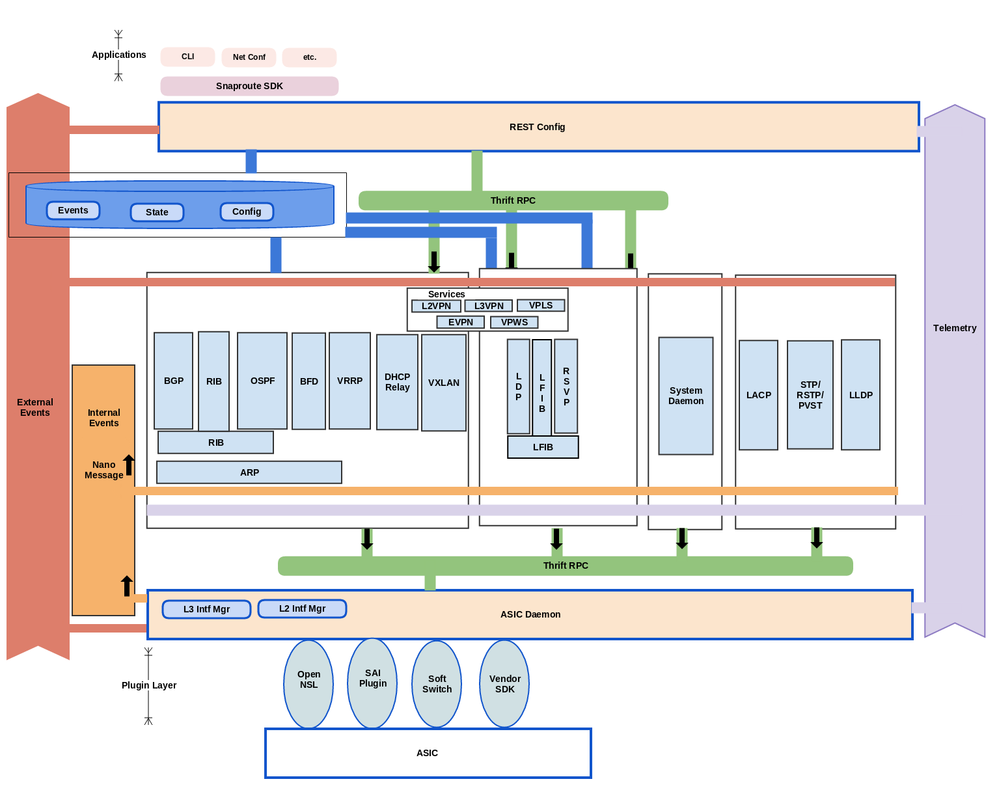
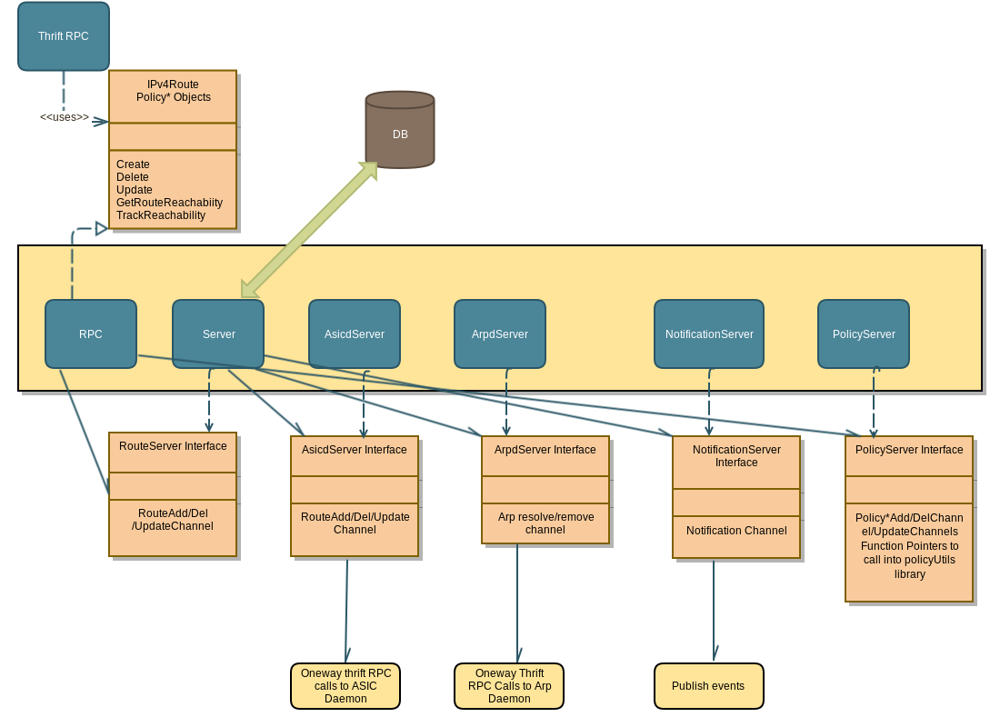
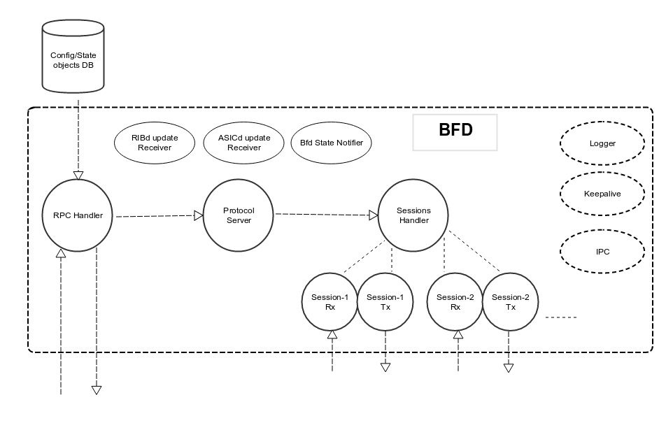

.. FlexSwitchSDK documentation master file, created by
   sphinx-quickstart on Mon Apr  4 12:27:04 2016.
   You can adapt this file completely to your liking, but it should at least
   contain the root `toctree` directive.

Introduction
============

What is FlexSwitch?
^^^^^^^^^^^^^^^^^^^
FlexSwitch is the first open source fully programmable layer2/3 network stack. 

Architecture
^^^^^^^^^^^^

System Architecture
"""""""""""""""""""

System Components
^^^^^^^^^^^^^^^^^

GoLang
""""""

Golang has become the modern programming language for systems and infrastructure programming.  Benefits of using GoLang:

	- **Statically typed and Compiled** - All the type safety issues are caught during compile time, unlike at run time like Python, Java Script
	- **Built In Garbage Collection**  - Programmer does not have to manage memory for allocation and frees. This eliminates many system crashes that are way too familiar for systems programmers.
	- **Built In  concurrency** - Golang's concurrency patterns are very powerful and easy to use. 
	- **Built in multi core support** - Golang's concurrency patterns are very powerful and easy to use.
 
FlexSwitch utilizes golang as the base language for all our development. This brings agility into our development and also quality into our software

Python
""""""

RPC tools
"""""""""

Most modern software needs to interact with other software modules in some fashion.  Using RPC is one of very well known mechanisms to achieve this
Thanks to the opensource community. There are a few comprehensive solutions available 

Thrift RPC
++++++++++

Apache Thrift has been very stable and scalable solution for Inter Process Communication (IPC)/Remote Procedure Calls (RPC)

	- **Cross language, Multi language support** - Thrift supports multiple languages( golang, python, C++ etc). Clients and servers can be developed in  different languages.  
	- **Simple Interface Definition Language** - IDL defined by Thrift is very simple to use. 
	- **Compiler to generate Client and Server** - Thrift compiler generates client and server in various languages.
	- **Best performance among other choices** - Thrift offers better performance than other RPC tools including gRPC, Protobuf3

FlexSwitch utilizes Thrift for internal communication among our daemons. Thrift RPC is used only from top to down (i.e.) clients to servers.
FlexSwitch ensures not to use RPC from a server to client allowing daemons to remain agnostic of their clients thus eliminating spaghetti dependencies. 

Pub/Sub Mechanisms 
""""""""""""""""""

FlexSwitch software uses non-persistent pub/sub mechanism for notifying its internal components. We need a lightweight and efficient Pub/sub mechanism 

Nano Message
++++++++++++
    
Nano-Message offers clean posix compliant APIs. Performance numbers against Nano Message are much better than its counterparts like ZeroMQ, D-Bus etc
We use Nano Message library in ASICd to notify other protocol daemons about possible events like interface creation, deletion link up/down

Linux
"""""

FlexSwitch software runs on linux in userspace, keeping with the portability and flexibility mantra engrained into our code. 
Due to stability, security and wide spread adoption, Linux has become the defacto standard for all the networking equipment. 

Configuration and State Database
""""""""""""""""""""""""""""""""
FlexSwitch software stores its configuration and state in database to facilitate restoring configuration after restart and to make it easy for the customer applications to read the state of the system. We needed a database that is very efficient. 

Redis
+++++
   
Redis was written in ANSI C and very scaleable database. It also several other features.

	- **In-Memory database** - Redis works primarily as In-Memory database with the option of synchronising the data to disk when needed. This is ideal for storing large state data like MAC Tables, Route tables, Statistics etc
	- **Pub/Sub mechanism** - In addition to working as a database Redis offers pub/sub mechanism. So it can be used as a message broker as well.
	- **High-availability** - Redis provides high-availability by supporting clusters. This would also help in Chassis based systems very well.

FlexSwitch utilizes Redis for storing system state, configuration, and externally visible events like link down, link up etc. 

Infrastructure Daemons
^^^^^^^^^^^^^^^^^^^^^^

Configuration Manager
"""""""""""""""""""""

The front-end to our RestBased API's.  Confd acts as a router to direct the API call to the correct Daemon or Database to the collect the appropriate information. 

System Daemon 
"""""""""""""

Monitors other system components and reports on their health. 

Routing Information Base
"""""""""""""""""""""""""

This is FlexSwitch's central location for all route information and manipulation.  Any IPv4/IPv6 route that needs to be programmed into the underlying Merchant silicon is processed by the 
RIB. 

ASIC Daemon
"""""""""""

ASICd abstracts away hardware differences across ASIC vendors.  This allows for our protocol stack to be easily be ported to any ASIC from any Vendor.  

Protocol Daemons
^^^^^^^^^^^^^^^^

FlexSwitch utilizes many different protocol daemons.  Each one is an independent structure that runs as a separate daemon independent of the system as a whole. 
This allows for any set of daemons to be run based on end-user preference.  This results in less code being executed and thus greater stability. 

ARP Daemon
""""""""""

.. image:: images/ARP.png

BFD Daemon
""""""""""

OSPF Daemon
"""""""""""

.. image:: images/OSPF_Architecture.png

BGP Daemon
""""""""""

.. image:: images/BGP_Architecture.png

STP Daemon
""""""""""

.. image:: images/STP_Architecture.png

LACP Daemon
"""""""""""

.. image:: images/LACP_Architecture.png

VXLAN Daemon
""""""""""""

.. image:: images/VXLAN_Architecture.png

VRRP Daemon
"""""""""""

.. image:: images/VRRP_Architecture.png

How to use it?
^^^^^^^^^^^^^^

FlexSwitch comes supplied with a configuration manager which supplies the FrontEnd to our system and acts as a light-weight director of RESTful API calls.  This is the portion of the system, that will direct a configuration item to the appropriate daemon or database call.  In order to simplify how these calls are segmented for the user, the API calls are organized into two categories. *State* and *Config* operations.  Every object in the system has both a State and Config operation that can be performed against it.  

On the Config portion, this means when you supply the data you want in JSON format and sent to the associated API to have the configuration applied.  These operations can be done in 3 ways:

 - Directly calling the RestFul API
 - Utilizing the supplied Python SDK
 - Utilizing Ansible to push a configuration file. 

Utilizing the Rest API
""""""""""""""""""""""

Below will be an example of how to utilize the RestFul API to adjust the ARP global timeout value. 

In order to perform this operation with the Restful API, you would create the JSON and send to the ArpConfig REST API:

::

        root@5b5a8d783113:/# curl -X POST --header 'Content-Type: application/json' --header 'Accept: application/json' -d '{"ArpConfigKey":"1", "Timeout":1000}' http://localhost:8080/public/v1/config/ArpConfig
        {"ObjectId":"a97b920d-8b10-47b1-7ea9-890b07f6e712","Error":""}
  
As you can see This is a 1:1 mapping of config to a specifc Object, in this case Timeout value of 1000 to ARP.

On the State side, this is more invovled, since you can have multiple items, that could potentially have thousand of different states.  Think the prefixes/next-hop entries` in the routing table or multiple IP/MAC mappings with an ARP table.  Due to this variance in data supplied, State operations are broken down into GetBulk, which supplies information from the entire object OR just an indiviual Get, which returns, just the parameters requested from an object.  The way in which these calls are made is based on the pluralization of the object itself.  

Lets use ARP again as an example.  If you wished to grab all entry's from the ARP table, you would query the "*ArpEntry*" state object. However, in order to dictate you wanted all entires, rather than a specific value, you would add a trailing "*s*" to make the operation plural, resulting in a call of "*ArpEntrys*", see below:

::

        root@5c3bca6fb77e:/# curl -X GET --header 'Content-Type: application/json' 'http://localhost:8080/public/v1/state/ArpEntrys' | python -m json.tool
          % Total    % Received % Xferd  Average Speed   Time    Time     Time  Current
                                         Dload  Upload   Total   Spent    Left  Speed
        100   213  100   213    0     0  44654      0 --:--:-- --:--:-- --:--:-- 53250
        {
            "CurrentMarker": 0,
            "MoreExist": false,
            "NextMarker": 0,
            "ObjCount": 1,
            "Objects": [
                {
                    "Object": {
                        "ExpiryTimeLeft": "9m57.74904463s",
                        "Intf": "eth1",
                        "IpAddr": "51.1.1.5",
                        "MacAddr": "4e:8c:3d:c8:d4:09",
                        "Vlan": "5"
                    },
                    "ObjectId": ""
                }
            ]
        }

If you attempted to make such a call to just "*ArpEntry*", you would be returned an error:

::

	root@5c3bca6fb77e:/# curl  -H "Accept: application/json" "http://localhost:8080/public/v1/state/ArpEntry" | python -m json.tool
	  % Total    % Received % Xferd  Average Speed   Time    Time     Time  Current
					 Dload  Upload   Total   Spent    Left  Speed
	100   119  100   119    0     0  21715      0 --:--:-- --:--:-- --:--:-- 23800
	{
	    "Error": "Failed to find entry. Internal error processing GetArpEntryState: Unable to find Arp entry for given IP: \n"
	}

This is due to the fact, that configruation manager expected JSON data to be supplied requesting a specific parameter to search the ARP table on. 

In order to sucessfully, complete the "*ArpEntry*" query, we will supply JSON data for IP address 51.1.1.5:

::

        root@5c3bca6fb77e:/# curl -X GET --header 'Content-Type: application/json' -d '{"IpAddr":"51.1.1.5"}' 'http://localhost:8080/public/v1/state/ArpEntry' | python -m json.tool
          % Total    % Received % Xferd  Average Speed   Time    Time     Time  Current
                                         Dload  Upload   Total   Spent    Left  Speed
        100   157  100   136  100    21  25185   3888 --:--:-- --:--:-- --:--:-- 27200
        {
            "Object": {
                "ExpiryTimeLeft": "9m56.277773536s",
                "Intf": "eth1",
                "IpAddr": "51.1.1.5",
                "MacAddr": "4e:8c:3d:c8:d4:09",
                "Vlan": "5"
            },
            "ObjectId": ""
        }

The call now returns sucessfully with the requested data.  Also note, that returned data is no longer wrapped in GetBulk "*Objects*" header; I.E. the following is missing:
::

            "CurrentMarker": 0,
            "MoreExist": false,
            "NextMarker": 0,
            "ObjCount": 1,
            "Objects": [{}]

This is due to the fact, that only a single object of data was targeted, rather than a bulk operation. The extra object data is not required for a GetBulk operation. 

 

Utilizing the Python SDK 
""""""""""""""""""""""""

Below will be an example of how to utilize the Python SDK to adjust the ARP global timeout value. 

In order to perform this operation with the Python SDK API, you would utilize the following python methods:

::  

	>>>from flexswitchV2 import FlexSwitch
	>>> FlexSwitch("10.1.10.243", 8080).createArpConfig("1", 1000)
	({u'ObjectId': u'45dff5a0-7dc1-441d-723d-ccf731186ece', u'Error': u''}, None)      

.. Note:: the ObjectID and UUID are the same.

As you can see This is a 1:1 mapping of config to a specifc Object, in this case Timeout value of 1000 to ARP.

On the State side, this is more invovled, since you can have multiple items, that could potentially have thousand of different states.  Think the prefixes/next-hop entries in the routing table or multiple IP/MAC mappings with an ARP table.  Due to this variance in data supplied, State operations are broken down into GetBulk, which supplies information from the entire object OR just an indiviual Get, which returns, just the parameters requested from an object.  The way in which these calls are made is performed by utilizing the method with "*getAll*" followed by the Object you wanted to grab; I.E. Arp, Bfd, BGP, etc.  

Lets use ARP again as an example.  If you wished to grab all state entry's from the ARP table, you would utilize the "*getAllArpEntryStates()*" method. With all Python SDK methods, see below:

::

	>>> from flexswitchV2 import FlexSwitch
	>>> FlexSwitch("10.1.10.243", 8080).getAllArpEntryStates()
	[{u'Object': {u'ConfigObj': None, u'Intf': u'fpPort47', u'Vlan': u'Internal Vlan', u'IpAddr': u'172.16.0.14', u'ExpiryTimeLeft': u'9m24.869691096s', u'MacAddr': u'a8:9d:21:aa:8e:01'}, u'ObjectId': u''}, {u'Object': {u'ConfigObj': None, u'Intf': u'fpPort49', u'Vlan': u'Internal Vlan', u'IpAddr': u'172.16.0.20', u'ExpiryTimeLeft': u'9m43.991376701s', u'MacAddr': u'00:02:03:04:05:00'}, u'ObjectId': u''}]

If you wanted to make  a call to just grab a specific Arp Entry from the state table, you would utilize method, getArpEntryStates(), see below:

::

	>>> from flexswitchV2 import FlexSwitch
	>>> FlexSwitch("10.1.10.243", 8080).getArpEntryState("172.16.0.20")
	({u'Object': {u'ConfigObj': None, u'Intf': u'fpPort49', u'Vlan': u'Internal Vlan', u'IpAddr': u'172.16.0.20', u'ExpiryTimeLeft': u'16m38.505153914s', u'MacAddr': u'00:02:03:04:05:00'}, u'ObjectId': u''}, None)

The call now returns sucessfully with only the requested data. 

 

Utilizing Ansible
"""""""""""""""""

